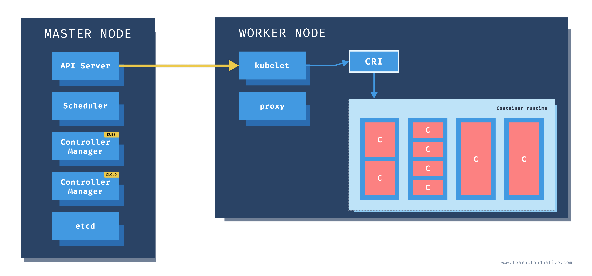
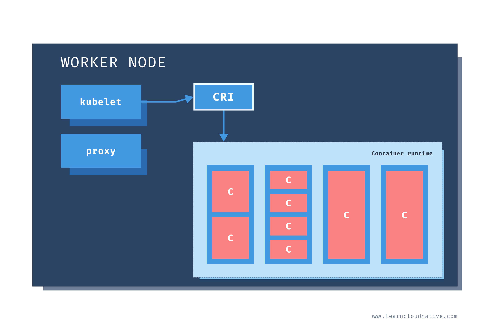

# Kubernetes architecture
Source : https://learncloudnative.com/blog/2020-05-26-getting-started-with-kubernetes-part-1 
Start Kubernetes - Peter Jausovec

A  Kubernetes  cluster  is  a  set  of  physical  or  virtual  machines  and  other  infrastructure  resources
needed  to  run  your  containerized  applications.  Each  machine  in  a  Kubernetes  cluster  is  called  a
node. There are two types of node in each Kubernetes cluster:
- Master node(s): this node hosts the Kubernetes control plane and manages the cluster
-  Worker node(s): runs your containerized applications

## Master Nodes

One  of  the  main  components  on  the  master  node  is  called  the  API  server.  The  API  server  is  the
endpoint  that  Kubernetes  CLI  (kubectl)  talks  to  when  you’re  creating  Kubernetes  resources  or
managing the cluster.
The scheduler component works with the API server to schedule the applications or workloads on
to  the  worker  nodes.  It  also  knows  about  resources  available  on  the  nodes  and  the  resources
requested  by  the  workloads.  Using  this  information,  it  can  decide  on  which  worker  nodes  your
workloads end up

he kube controller manager runs multiple controller processes. These controllers watch the state
of  the  cluster  and  try  to  reconcile  the  current  state  of  the  cluster  (e.g.,  "5  running  replicas  of
workload  A")  with  the  desired  state  (e.g.  "I  want  ten  running  replicas  of  workload  A"). 

## Worker nodes

  worker  nodes  have  different  components  running  as  well.  The  first
one  is  kubelet.  This  service  runs  on  each  worker  node,  and  its  job  is  to  manage  the  container.  It
makes sure containers are running and healthy, and it connects back to the control plane. Kubelet
talks to the API server, and it is responsible for managing resources on the node it’s running on.

When you add a new worker node to the cluster, the kubelet introduces itself to the API server and
provides its resources (e.g., "I have X CPU and Y memory"). Then, it asks the API server if there are
any containers to run. You can think of the kubelet as a worker node manager.
Kubelet  uses  the  container  runtime  interface  (CRI)  to  talk  to  the  container  runtime

The  containers  are  running  inside  pods,  represented  by  the  blue  rectangles  in  the  above  figure
(containers  are  the  red  rectangles  inside  each  pod).  A  pod  is  the  smallest  deployable  unit  you  can
create,  schedule,  and  manage  on  a  Kubernetes  cluster.  A  pod  is  a  logical  collection  of  containers
that make up your application. The containers running inside the same pod also share the network
and storage space.
Each worker node also has a proxy that acts as a network proxy and a load balancer for workloads
8
running  on  the  worker  nodes.  Through  these  proxies,  the  external  load  balancer  redirects  client
requests to containers running inside the pod.

