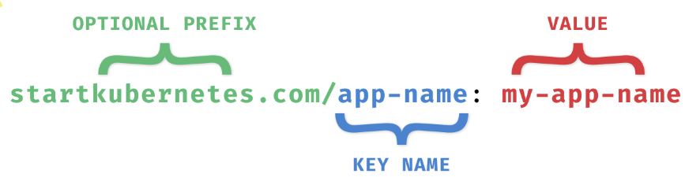

# Kubernetes Resources

The  Kubernetes  API  defines  many  objects  called  resources,  such  as  namespaces,  pods,  services,
secrets, config maps, etc. 
you can also define your custom resources using the custom resource definition or CRD

``` kubectl  api-resources ```

This command will list all defined resources - there will be  lot of them , Every  Kubernetes  resource  has  an  apiVersion  and  kind  fields  to  describe  which  version  of  the Kubernetes API you’re using when creating the resource (for example, apps/v1) and what kind of a
resource you are creating (for example, Deployment, Pod, Service, etc.).

# Labels and selectors

You  can  use  labels  (key/value  pairs)  to  label  resources  in  Kubernetes. They  are  used  to  organize,
query, and select objects and attach identifying metadata to them. The labels have two parts: the key name and the value. The key name can have an optional prefix
and the name, separated by a slash (/).
The startkuberenetes.com portion in the figure is the optional prefix, and the key name is app-name.
The prefix, if specified, must be a series of DNS labels separated by dots (.). It can’t be longer than
253 characters.



## Selector

Selectors are used to query for a set of Kubernetes resources. For example, you could use a selector
to identify all Kubernetes cluster objects with a label env set to staging-us-west. You could write that
selector as env = staging-us-west. This selector is called an equality-based selector

The  second  type  of  selector  is  called  set-based  selectors.  These  selectors  allow  filtering  label  keys
based on a set of values. The following three operators are supported: in, notin, and exists. Here’s

``` yaml 
an example:
env in (staging-us-west,staging-us-east)
owner notin (ricky, peter)
department
department! 
``` 

Labeling resources is essential, so make sure you take your time to decide on the core set of labels
you  will  use  in  your  organization.  Setting  labels  on  all  resources  make  it  easier  to  do  bulk
operations against them later on.

Kubernetes provides a list of recommended labels that share a common prefix app.kubernetes.io:

| Name                          | Value          | Description                                       |
|------------------------------|---------------|---------------------------------------------------|
| app.kubernetes.io/name       | my-app        | Application name                                  |
| app.kubernetes.io/instance   | my-app-1122233| Identifying instance of the application          |
| app.kubernetes.io/version    | 1.2.3         | Application version                              |
| app.kubernetes.io/component  | website       | The name of the component                       |
| app.kubernetes.io/part-of    | carts         | The name of the higher-level application this component is part of |
| app.kubernetes.io/managed-by | helm          | The tools used for managing the application     |

Additionally, you could create an maintain a list of your own labels:
• Project ID (carts-project-123)
• Owner (Ricky, Peter, or team-a, team-b, ...)
• Environment (dev, test, staging, prod)
• Release identifer (release-1.0.0`)
• Tier (backend, frontend)

## Annotations

Annotations  are  similar  to  labels  as  they  also  add  metadata  to  Kubernetes  objects.  However,  you
don’t  use  annotations  for  identifying  and  selecting  objects. Examples would be information needed for debugging,
emails, or contact information of the on-call engineering team, port numbers or URL paths used by
monitoring or logging systems , Similar to labels, annotations are key/value pairs. The key name has two parts and the same rules
apply as with the label key names.
However, the annotation values can be both structured or unstructured and can include characters
that are not valid in the labels

# Working with Pods

Pods are probably one of the most common resources in Kubernetes. They are a collection of one or more containers. The containers within the pod share the same network and storage. This means that any containers within the same pod can talk to each other through localhost.

Pods are designed to be ephemeral, which means that they last for a very short time. Pods can get rescheduled to run on different nodes at any time. This means any time your pod is restarted, your containers will be restarted as well


When  created,  each  Pod  gets  assigned  a  unique  IP  address.  The  containers  inside  your  Pod  can
listen  to  different  ports.  To  access  your  containers,  you  can  use  the  Pods'  IP  address.  Using  the
example from the above figure, you could run curl 10.1.0.1:3000 to talk to the one container and
curl  10.1.0.1:5000 to talk to the other container. However, if you wanted to talk between
containers - for example, calling the top container from the bottom one, you could use
http://localhost:3000.

If your Pod restarts, it will get a different IP address. Therefore, you cannot rely on the IP address.
Talking to your Pods directly by the IP is not the right way to go.
An  abstraction  called  a  Kubernetes  Service  is  what  you  can  to  communicate  with  your  Pods.  A
Kubernetes Service gives you a stable IP address and DNS name.

### Scaling Pods


All containers within the Pod get scaled together. The figure below shows how scaling from a single
Pod to four Pods would look like. Note that you cannot scale individual containers within the Pods.
The  Pod  is  the  unit  of  scale,  which  means  that  whenever  you  scale  a  Pod,  you  will  scale  all
containers inside the Pod as well. econd,  running  a  stateful  workload  in  Kubernetes,  such  as  a  database,  differs  from  running
stateless workloads. For example, you need to ensure that data is persistent between Pod restarts
and  that  the  restarted  Pods  have  the  same  network  identity.  You  can  use  resources  like  persistent
volumes and stateful sets to accomplish this. We will discuss running stateful workloads in
Kubernetes in Stateful Workloads section.
Creating Pods
Usually,  you  shouldn’t  be  creating  Pods  manually.  You  can  do  it,  but  you  really  should  not.  The
reason  being  is  that  if  the  Pod  crashes  or  if  it  gets  deleted,  it  will  be  gone  forever.  That  said,
throughout  this  book,  we  will  be  creating  Pods  directly  for  the  sake  of  simplicity  and  purposes  of
learning  and  explaining  different  concepts.  However,  if  you’re  planning  to  run  your  applications
inside Kubernetes, make sure you aren’t creating Pods manually.
Let’s look at how a single Pod can be defined using YAML.

### Creating Pods

Usually, you shouldn't be creating Pods manually. You can do it, but you really should not. The reason being is that if the pod crashes or if it gets deleted, it will be gone forever.
Let's look at how a single pod can be defined using YAML.

```yaml
apiVersion: v1
kind: Pod
metadata:
  name: hello-pod
  labels:
    app: hello
spec:
  containers:
    - name: hello-container
      image: busybox
      command: ['sh', '-c', 'echo Hello from my container! && sleep 3600']
```

In  the  first  couple  of  lines,  we  define  the  kind  of  resource  (Pod)  and  the  metadata.  The  metadata
includes  the  name  of  our  Pod  (hello-pod)  and  a  set  of  labels  that  are  simple  key-value  pairs.

In  the  spec  section,  we  are  describing  how  the  Pod  should  look.  We  will  have  a  single  container
inside this Pod, called hello-container, and it will run the image called busybox. When the container
starts, it executes the command defined in the command field.
To  create  the  Pod,  you  can  save  the  above  YAML  to  a  file  called  pod.yaml.  Then,  you  can  use
Kubernetes CLI (kubectl) to create the Pod:

```bash 
$ kubectl apply -f pod.yaml
pod/hello-pod created.
```

### Managing Pods with ReplicaSets

The job of a ReplicaSet is to maintain a stable number of Pod copies or replicas. The ReplicaSet controller guarantees that a specified number of identical Pods is running at all times. The replica count is controlled by the replicas field in the resource definition.
If you start with a single Pod and you want to scale to 5 Pods, the ReplicaSet controller uses that current state (one pod) in the cluster and goes and creates four more Pods to meet the desired state (5 Pods). The ReplicaSet also keeps an eye on the Pods, so if you delete one or scale it up or down, it will do the necessary to meet the desired number of replicas. To create the Pods, ReplicaSet uses the Pod template that's part of the resource definition.

```yaml
apiVersion: apps/v1
kind: ReplicaSet
metadata:
  name: hello
  labels:
    app.kubernetes.io/name: hello
spec:
  replicas: 5 ### Nombre de pods ( Replicas )
  selector:
    matchLabels:
      app: hello ### Qu'elle pod observé
  template: ### Les templates a utilisé
    metadata:
      labels:
        app.kubernetes.io/name: hello
    spec:
      containers:
        - name: hello-container
          image: busybox
          command: ['sh', '-c', 'echo Hello from my container! && sleep 3600']
```

Every Pod that's created by a ReplicaSet can be identified by the metadata.ownerReferences field. This field specifies which ReplicaSet owns the Pod. If any of the Pods owned by the ReplicaSet is deleted, the ReplicaSet nows about it and acts accordingly (i.e. re-creates the Pod)
The ReplicaSet also uses the selector object and matchLabel to check for any new Pods that it might own. If there's a new Pod that matches the selector labels the ReplicaSet and it doesn't have an owner reference or the owner is not a controller (i.e. if we manually create a Pod), the ReplicaSet will take it over and start controlling it.

You can also list the Pods by their labels. For example, if you run kubectl get po -l=app=hello, you will get all Pods that have app=hello label set. This, at the moment, is the same 5 Pods we created.
Let's also look at the owner reference field. We can use the -o yaml flag to get the YAML representation of any object in Kubernetes. Once we get the YAML, we will search for the ownerReferences string:


```yaml
kubectl get po hello-dwx89 -o yaml | grep -A5 ownerReferences
...
  ownerReferences:
  - apiVersion: apps/v1
    blockOwnerDeletion: true
    controller: true
    kind: ReplicaSet
    name: hello
```

In the ownerReferences, the name of the owner is set to hello, and the kind is set to ReplicaSet. This is the ReplicaSet that owns the Pod

### Zero-downtime updates?

I mentioned zero-downtime deployments and updates earlier. How can that be done using a replica set? Well, it can't be done. At least not in a zero-downtime manner.
Let's say we want to change the Docker image used in the original replica set from busybox to busybox:1.31.1. We could use kubectl edit rs hello to open the replica set YAML in the editor, then update the image value.
Once you save the changes - nothing will happen. Five Pods will still keep running as if nothing has happened. Let's check the image used by one of the Pods:

```yaml
$ kubectl describe po hello-fchvr | grep image
  Normal  Pulling    14m        kubelet, docker-desktop  Pulling image "busybox"
  Normal  Pulled     13m        kubelet, docker-desktop  Successfully pulled image "busybox"
```

Notice it's referencing the busybox image, but there's no sign of the busybox:1.31.1 anywhere. Let's see what happens if we delete this same Pod:

```yaml
$ kubectl delete po hello-fchvr
pod "hello-fchvr" deleted.
```

From the previous test we did, we already know that ReplicaSet will bring up a new Pod (hello-q8fnl in our case) to match the desired replica count. If we run describe against the new Pod that came up, you will notice how the image is changed this time:

```yaml
$ kubectl describe po hello-q8fnl | grep image
  Normal  Pulling    74s        kubelet, docker-desktop  Pulling image "busybox:1.31"
  Normal  Pulled     73s        kubelet, docker-desktop  Successfully pulled image "busybox:1.31"
```
Similar would happen if we delete the other Pods that are still using the old image (busybox).

The ReplicaSet would start new Pods and this time the Pods would use the new image busybox:1.31.1.
There is another resource that can be used to manage the ReplicaSets and allows us to update Pods in a controlled manner. Upon changing the image name it can start Pods using the new image names in a controlled manner. This resource is called a Deployment.
To delete all Pods you need to delete the ReplicaSet by running: kubectl delete rs hello. rs is the short name for replicaset. If you list the Pods (kubectl get po) right after you issued the delete command you will see the Pods being terminated:

```yaml
NAME          READY   STATUS        RESTARTS   AGE
hello-fchvr   1/1     Terminating   0          18m
hello-fl6hd   1/1     Terminating   0          18m
hello-n667q   1/1     Terminating   0          18m
hello-rftkf   1/1     Terminating   0          18m
hello-vctkh   1/1     Terminating   0          7m39s
```
Once replica set terminates all Pods, they will be gone, and so will be the ReplicaSet.

## Creating Deployments

A deployment resource is a wrapper around the ReplicaSet that allows doing controlled updates to
your  Pods.  For  example,  if  you  want  to  update  image  names  for  all  Pods,  you  can  edit  the  Pod
template, and the deployment controller will re-create Pods with the new image.

```yaml
....
kind: Deployment
....
```

Why  the  --record  flag?  Using  this  flag,  we  are  telling  Kubernetes  to  store  the
command we executed in the annotation called kubernetes.io/change-cause. Record
flag  is  useful  to  track  the  changes  or  commands  that  you  executed  when  the
deployment was updated. You will see this in action later on when we do rollouts.

To list all deployments, we can use the get command:
```yaml
$ kubectl get deployment
NAME    READY   UP-TO-DATE   AVAILABLE   AGE
hello   5/5     5            5           2m8s
```

The  output  is  the  same  as  when  we  were  listing  the  ReplicaSets.  When  we  create  the  deployment,
controller also creates a ReplicaSet:

```yaml
$ kubectl get rs
NAME               DESIRED   CURRENT   READY   AGE
hello-6fcbc8bc84   5         5         5       3m17s
```
Notice how the ReplicaSet name has the random string at the end. Finally, let's list the Pods:
```yaml
$ kubectl get po
NAME                     READY   STATUS    RESTARTS   AGE
hello-6fcbc8bc84-27s2s   1/1     Running   0          4m2s
hello-6fcbc8bc84-49852   1/1     Running   0          4m1s
hello-6fcbc8bc84-7tpvs   1/1     Running   0          4m2s
hello-6fcbc8bc84-h7jwd   1/1     Running   0          4m1s
hello-6fcbc8bc84-prvpq   1/1     Running   0          4m2s
```

When we create a ReplicaSet previously, the Pods were named like this: hello-fchvr. However, this time, the Pod names are a bit longer - hello-6fcbc8bc84-27s2s. The middle random section in the name 6fcbc8bc84 corresponds to the random section of the ReplicaSet name and the Pod names are created by combining the deployment name, ReplicaSet name and a random string.


### How to scale the Pods up or down?


There's a handy command in Kubernetes CLI called scale. Using this command we can scale up (or down) the number of Pods controlled by the Deployment or a ReplicaSet.
Let's scale the Pods down to 3 replicas:

```
$ kubectl scale deployment hello --replicas=3
deployment.apps/hello scaled
```

```
$ kubectl get po
NAME                     READY   STATUS    RESTARTS   AGE
hello-6fcbc8bc84-49852   1/1     Running   0          48m
hello-6fcbc8bc84-7tpvs   1/1     Running   0          48m
hello-6fcbc8bc84-h7jwd   1/1     Running   0          48m
```

Similarly, we can increase the number of replicas back to five, and ReplicaSet will create the Pods.

```
$ kubectl scale deployment hello --replicas=5
deployment.apps/hello scaled
```

```
$ kubectl get po
NAME                     READY   STATUS    RESTARTS   AGE
hello-6fcbc8bc84-49852   1/1     Running   0          49m
hello-6fcbc8bc84-7tpvs   1/1     Running   0          49m
hello-6fcbc8bc84-h7jwd   1/1     Running   0          49m
hello-6fcbc8bc84-kmmzh   1/1     Running   0          6s
hello-6fcbc8bc84-wfh8c   1/1     Running   0          6s
```

### Updating the Pod templates