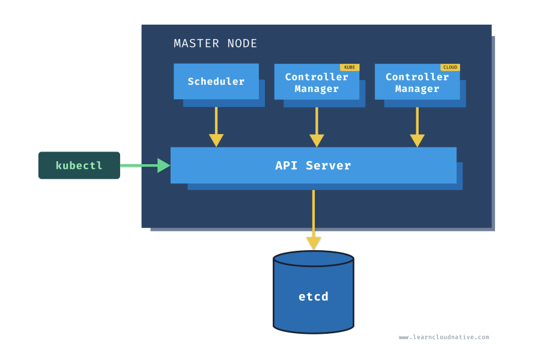

## Qu'est-ce que Kubernetes ?
Kubernetes est une plateforme open-source d'orchestration de conteneurs qui automatise de nombreux processus liés au déploiement, à la gestion et à la mise à l'échelle des applications conteneurisées.

Kubernetes automatise la configuration des applications, suit l'allocation des ressources et assure la gestion des conteneurs. Issu de la Cloud Native Computing Foundation (CNCF), Kubernetes a été introduit en 2014 et est aujourd'hui largement adopté par les entreprises pour exécuter des applications et services distribués à grande échelle.

Source : [Red Hat - What is Kubernetes](https://www.redhat.com/en/topics/containers/what-is-kubernetes)

## Concepts et terminologies clés
Kubernetes repose sur plusieurs concepts et terminologies essentiels :

- **Architecture du cluster** : Concepts fondamentaux de l'architecture Kubernetes.
- **Conteneurs** : Technologie permettant d'emballer une application avec ses dépendances d'exécution.
- **Workloads** : Comprendre les Pods, la plus petite unité de déploiement dans Kubernetes, et les abstractions qui facilitent leur exécution.
- **Services, équilibrage de charge et réseau** : Concepts et ressources liés à la gestion du réseau dans Kubernetes.
- **Stockage** : Solutions pour fournir un stockage temporaire ou persistant aux Pods du cluster.
- **Configuration** : Ressources permettant de configurer les Pods et autres objets Kubernetes.
- **Administration du cluster** : Détails avancés pour la création et la gestion d'un cluster Kubernetes.

## Contexte

Pour obtenir plus de contexte sur votre cluster Kubernetes, utilisez la commande suivante :

```bash
kubectl config current-context
```

Exemple de sortie :

```bash
thor@DESKTOP-TF4VOVB:~$ kubectl config current-context
docker-desktop
```

## Architecture de Kubernetes

### Nœuds Kubernetes

Un cluster Kubernetes est composé de machines physiques ou virtuelles et de ressources d'infrastructure permettant d'exécuter des applications conteneurisées. Chaque machine dans un cluster est appelée un **nœud**. Il existe deux types de nœuds dans un cluster Kubernetes :

- **Nœud maître (Master Node)** : Héberge le plan de contrôle Kubernetes et gère le cluster.
- **Nœud de travail (Worker Node)** : Exécute les applications conteneurisées.

### Composants du nœud maître


- **API Server** : Point d'entrée principal pour la communication avec Kubernetes via la CLI.
- **Kube Controller Manager** : Exécute plusieurs processus de contrôle qui surveillent et ajustent l'état du cluster selon les spécifications définies (ex : nombre de réplicas souhaité pour un déploiement).
- **Cloud Controller Manager** : Gère les interactions avec les fournisseurs de cloud pour la gestion des ressources externes (ne fonctionne que dans un environnement cloud).

### Composants du nœud de travail

- **Kubelet** : S'exécute sur chaque nœud de travail et gère les conteneurs, en s'assurant qu'ils fonctionnent correctement. Il communique avec le plan de contrôle via l'API Server.
- **Kube Proxy** : Gère les règles réseau et assure la communication entre les Pods.

## Outils recommandés

Pour travailler en local avec Kubernetes, vous pouvez utiliser les outils suivants :

- **Docker Desktop** : Fournit un environnement Kubernetes intégré.
- **Minikube** : Permet d'exécuter un cluster Kubernetes localement sur une machine unique.
- **kind (Kubernetes IN Docker)** : Outil permettant d'exécuter Kubernetes dans des conteneurs Docker.

## Ressources Kubernetes

L'API Kubernetes définit plusieurs objets appelés **ressources**, tels que :

- **Namespaces** : Permettent d'organiser les ressources Kubernetes dans des espaces isolés.
- **Pods** : Plus petite unité de déploiement contenant un ou plusieurs conteneurs.
- **Services** : Exposent les applications conteneurisées aux autres services ou à l'extérieur du cluster.
- **Secrets et ConfigMaps** : Permettent de stocker et de gérer des informations de configuration sensibles.

Vous pouvez également définir des ressources personnalisées via les **Custom Resource Definitions (CRD)**.

Pour lister toutes les ressources disponibles dans votre cluster, utilisez :

```bash
kubectl api-resources
```

Chaque ressource Kubernetes possède des champs obligatoires :

- **apiVersion** : Définit la version de l'API utilisée (ex : `apps/v1`).
- **kind** : Spécifie le type de ressource (ex : `Deployment`, `Pod`, `Service`).
- **metadata** : Contient des informations sur la ressource, comme son nom et son espace de noms.
- **labels et annotations** : Métadonnées supplémentaires permettant d'organiser et d'annoter les ressources.

Après la création d'une ressource, Kubernetes ajoute automatiquement certains champs, comme `creationTimestamp`.