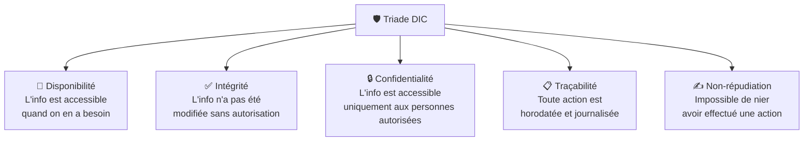

# Cybersécurité

!!! abstract "Objectif de la cybersécurité"
    Protéger la **confidentialité**, l'**intégrité** et la **disponibilité** des données
    et systèmes d'information contre toute menace interne ou externe.

-   :material-shield-key:{ .lg .middle } **Fondamentaux**

    ---

    Triade DIC, authentification, autorisation, Zero Trust, Kill Chain.

    [:octicons-arrow-right-24: Lire](introduction.md)

## La triade DIC en résumé

## Concepts clés de ce module

| Concept | Description courte |
|---------|-------------------|
| **Triade DIC** | Les 3 critères fondamentaux de sécurité des données |
| **AuthN / AuthZ** | Authentification (qui es-tu ?) vs Autorisation (que peux-tu faire ?) |
| **MFA** | Authentification multi-facteurs — au moins 2 facteurs différents |
| **Zero Trust** | "Ne jamais faire confiance, toujours vérifier" |
| **CVE** | Common Vulnerabilities and Exposures — base de données des failles connues |
| **Kill Chain** | Modélisation des étapes d'une cyber-attaque |
| **RBAC** | Role-Based Access Control — droits basés sur les rôles |
