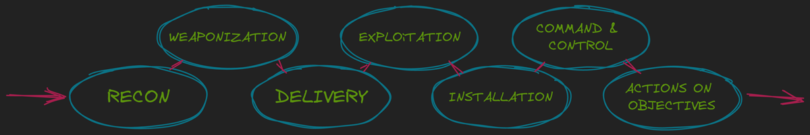
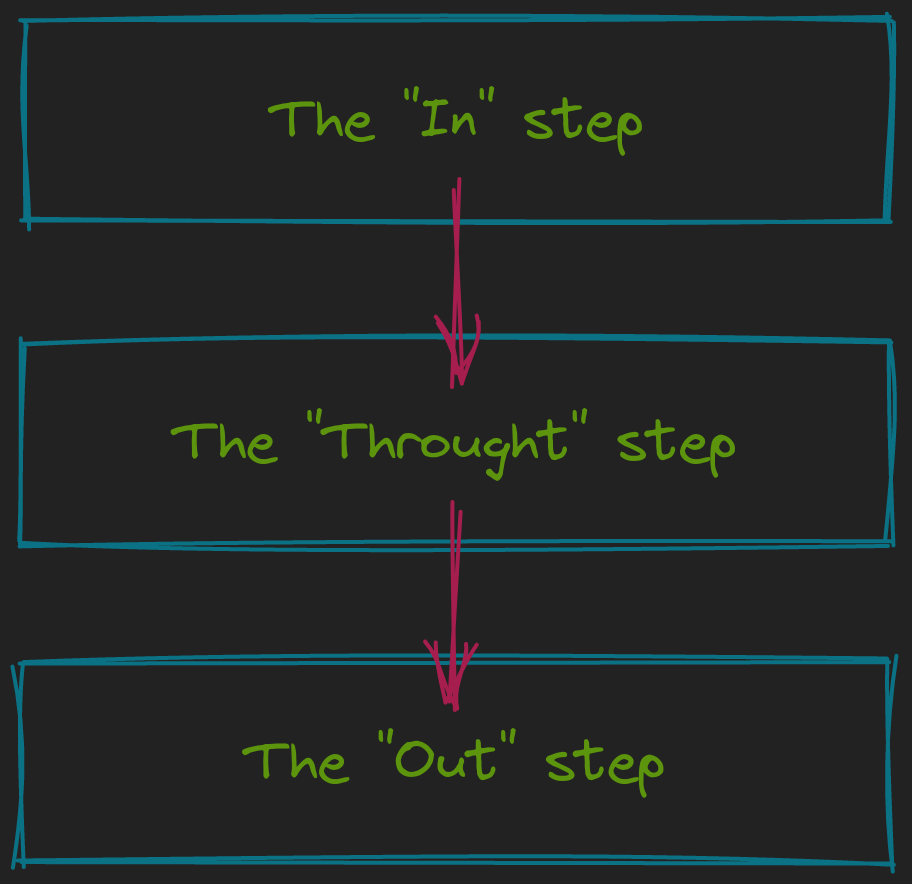

## Introduction à la Cybersécurité
Une donnée, dans le monde informatique, est une information qui peut être stockée ou traitée numériquement.

Un des principaux objectifs de la cyber sécurité est avant tout de protéger les données de l'entreprise ou d'un individu.

Nous allons étudier dans cette leçon les critères permettant de classifier ces données afin de mettre en place des solutions de protection adéquates.

### La triade DIC (+TN)
DIC
La triade "DIC", ou "CIA" en anglais, est constituée des trois principaux critères nécessaires à l'évaluation de la sensibilité des données.

Disponibilité (Availability)

Le critère de disponibilité évalue la garantie d'avoir accès à la donnée lorsqu'on en a besoin.

💡 Exemple : Lorsqu'un traitement automatisé va récupérer les données d'absence d'un salarié afin de calculer son salaire du mois, les données doivent être disponibles à chaque lancement du traitement, sinon il échoue.

Intégrité (Integrity)

Le critère d'intégrité évalue la garantie que l'état de la donnée n'a pas été modifié par rapport à son état original.

💡 Exemple : Dans une boutique en ligne, on ne doit pas pouvoir modifier les prix des produits disponibles si l'on est un client.

 

Confidentialité (Confidentiality)

Le critère de confidentialité évalue la garantie que l'accès à la donnée est réalisé uniquement par quelqu'un ou quelque chose qui a le droit d'y accéder (besoin d'en connaître).

💡 Exemple : Les motifs d'arrêt maladie doivent être consultables par le personnel habilité de l'assurance maladie, mais pas par l'employeur.

 

### TN
Bien que la triade DIC nous permette d'évaluer la sensibilité de la donnée afin d'y appliquer les justes mécanismes de protection, cette triade peut être étendue grâce à deux nouveaux critères.

Ces critères vont nous permettre en plus de la protection de la donnée, de nous faciliter le travail en cas d'incident impliquant ces données.

 

Traçabilité (Accounting)

Le critère de traçabilité évalue la garantie de connaître de manière datée tout ce qui a pu se produire, qu'il s'agisse de l'accès à la donnée ou de sa modification.

💡 Exemple : Lorsqu'un programme va consulter une donnée stockée dans une base de données, un journal de toutes les consultations, contenant l'heure et la donnée accédée, est conservé sur le serveur de base de données.

Non répudiation (Non-repudiation)

Le critère de non répudiation évalue la garantie de savoir qui a effectué une action sur une donnée, sans que celui-ci puisse remettre en question cette affirmation. C'est une extension de la traçabilité, ajoutant une notion d'identification.

💡 Exemple : Si j'utilise la signature numérique dans un document et que je tra

## Authentification

 
L'authentification (authentication en Anglais, souvent abrégé "AuthN"), est le processus de vérifier qu'une identité est bien celle qu'elle prétend être.

💡 Prenons l'exemple d'un site web avec un formulaire ayant deux champs, "adresse e-mail" et "mot de passe". Lorsque l'utilisateur saisit son adresse e-mail, il s'identifie. Lorsque l'utilisateur saisit son mot de passe et que le site web vérifie que le mot de passe saisi correspond à l'adresse e-mail saisie, l'utilisateur est authentifié.

 

Les différents facteurs d'authentification
Différents facteurs d'authentification (authentification factors) existent pour prouver une identité :

- Le facteur de connaissance (mot de passe, phrase de passe, code pin)
- Le facteur de possession (appareil avec application dédiée, token physique)
- Le facteur biométrique (empreinte digitale, empreinte de rétine, reconnaissance du visage)

À ces principaux facteurs, on pourrait aujourd'hui ajouter un quatrième facteur :

Le facteur géographique (localisation GPS, localisation de l'adresse IP)
 

### L'authentification forte
L'authentification forte, également appelée authentification à facteurs multiples (multi-factor authentication, MFA), est une bonne pratique de sécurité pour augmenter la résistance de l'authentification aux attaques courantes (leaked credentials, password-spraying, brute-force, etc.).

Pour qu'une authentification soit considérée comme forte, elle doit reposer sur au moins deux facteurs différents.

Plus le nombre de facteurs différents est élevé, plus l'authentification est forte.

💡 Par exemple, si je saisis un mot de passe et un code pin, l'authentification ne sera pas considérée forte malgré le fait d'avoir fourni deux facteurs. En revanche si je saisis un mot de passe et que je valide la demande sur l'application Authenticator de mon téléphone, j'ai bien réalisé une authentification forte.

### Autorisation
L'autorisation (authorization en Anglais, souvent abrégé "AuthZ"), est le processus de vérifier tout ce qu'une identité peut effectuer.

💡 Par exemple, lorsqu'un étudiant se connecte au site web de son école, il peut consulter ses relevés de notes, mais il n'est pas autorisé à modifier les notes.

Les différents types d'autorisation
Plusieurs modèles d'autorisation existent et peuvent cohabiter ou se superposer au sein d'un même périmètre :

- Role-based Access Control (RBAC) : les autorisations sont basées sur un rôle fonctionnel de l'identité.
> Exemple : Rôle d'administrateur de la base de données.

- Rule-based Access Control (RuBAC) : les autorisations sont basées sur des règles prédéfinies.
> Exemple : L'utilisateur Matthieu a accès au serveur entre 8 heures et 20 heures.

- Discretionary Access Control (DAC) : les autorisations sont basées sur des droits définis par le propriétaire de l'objet.
> Exemple : Matthieu est propriétaire du fichier "liste_primes.pdf" et donne l'accès en lecture à Thomas et en écriture à Max.

- Mandatory Access Control (MAC) : les autorisations sont basées sur des règles définies par l'administrateur, par défaut on rejette toutes les demandes d'autorisation.
> Exemple : L'équipe RH doit être la seule habilitée à visualiser les montants des salaires de tous les employés. L'administrateur a explicitement donné un droit nominatif à chaque membre de l'équipe RH.

- Attribute-based Access Control (ABAC) : les autorisations sont basées sur plusieurs attributs de l'identité.
> Exemple : L'accès sur l'intranet à la page du site de Tours est uniquement possible aux utilisateurs ayant comme localisation "Tours" dans l'annuaire de l'entreprise.

Au quotidien, chacun de ces modèles d'autorisation ont leurs avantages et leurs inconvénients. C'est pourquoi il convient de choisir avec précaution quel modèle utiliser et combiner différents modèles.

 

💡 Par exemple sur un partage de fichier, l'accès peut être globalement donné à tous les salariés de l'entreprise. En revanche le dossier "RH" est accessible à tous les utilisateurs ayant le rôle "Responsable RH" (RBAC). Le sous-dossier "Paris" est accessible uniquement aux personnes ayant le rôle "Responsable RH" et l'attribut "Localisation = Paris" (ABAC). Enfin, dans ce sous dossier, un document "bonus.pdf" est consultable uniquement par David et Marc (MAC).

Principe du moindre privilège
Le "besoin d'en connaître" est une expression qui vient à l'origine du monde militaire et des renseignements. Cela signifie la nécessité absolue pour une personne d'avoir accès à une information donnée.

Le "principe du moindre privilège" est une bonne pratique essentielle en cyber sécurité. Elle consiste à accorder à chaque utilisateur uniquement les droits d'accès minimum nécessaires à la réalisation de son travail.

Ces deux notions se retrouvent donc pleinement intégrées dans la gestion des autorisations. Qu'il s'agisse de l'accès à la donnée, ou bien de l'accès à des droits ou des privilèges, nous devons toujours nous assurer que ceux-ci sont uniquement ceux nécessaires et suffisants pour accomplir la tâche.

### Traçabilité
Le sujet de la traçabilité a déjà été évoqué dans la leçon sur la triade DIC et T (Disponibilité, Intégrité, Confidentialité et Traçabilité).

Les bonnes pratiques concernant la journalisation des évènements sont principalement les suivantes :

l'horodatage des évènements doit s'effectuer de manière précise et fiable.
le contenu du journal doit être qualitatif (simple, compréhensible mais sans omettre d'information).
le système de gestion des évènements doit être robuste, suffisamment dimensionné et sauvegardé selon les objectifs de rétention.
Pour aller plus loin sur le sujet, vous pouvez consulter le guide référence de l'ANSSI, Recommandations de sécurité pour l'architecture d'un système de journalisation.

## Vulnérabilité, menace et risque

Ces notions sont des bases essentielles pour mettre en oeuvre des processus de gestion des vulnérabilités et de gestion des risques.

### Vulnérabilité
Une vulnérabilité (vulnerability en Anglais) est une faiblesse dans un système, une configuration, un logiciel ou un processus.

Une vulnérabilité peut avoir plusieurs types :

Technique : bug dans un logiciel, mauvaise implémentation ou défaut d'architecture.
Humaine : ingénierie sociale, tel que le phishing par exemple.
La plupart des vulnérabilités existantes sont consignées dans une base de données unique, appelée Common Vulnerabilities and Exposures Database (CVE Database), supervisée par l'organisme MITRE. Elles disposent d'un numéro unique dans cette base de données.

Les détails techniques concernant les vulnérabilités sont quant à eux consignés dans d'autres bases de données, telle que la plus connue, la National Vulnerability Database (NVD) de l'organisme NIST.

💡 Par exemple, une des vulnérabilités les plus critiques de ces derniers temps, connue sous le nom de Log4Shell, est enregistrée sous l'identifiant "CVE-2021-44228" et est décrite ici.

 

Il existe deux manières de traiter une vulnérabilité :

Corriger : appliquer un patch fourni par l'éditeur, modifier la configuration mal implémentée
Contourner : appliquer une barrière qui rend la vulnérabilité impossible à exploiter, sans pour autant la corriger.
💡 Exemple de contournement : l'interface web d'administration d'un firewall contient une vulnérabilité. Vous décidez de rendre indisponible cette interface, et d'administrer le firewall uniquement en ligne de commande.

###Menace
Une menace (threat en Anglais) est n'importe quel évènement pouvant vous porter un préjudice. Ces menaces peuvent être de différents types, même ceux auquel vous pensez le moins :

Attaquant externes voulant vous extorquer de l'argent ou vous nuire.
Catastrophes naturelles.
Attaquant interne, tel qu'un salarié malveillant.
Évènement extérieur, terrorisme, guerre.
Afin de mieux comprendre les menaces qui concernent nos activités numériques, il existe un processus en cyber sécurité appelé "Cyber Threat Intelligence" (CTI).

De nombreux outils et frameworks existent pour aider à comprendre et modéliser ces menaces, vous pouvez par exemple vous documenter sur ce qu'on appelle la "Cyber Kill Chain" en guise d'introduction (une leçon dédiée à la Kill Chain est disponible dans ce cours).

### Risque
Le risque (risk en Anglais) est la conjonction de la vulnérabilité et de la menace. Si votre système est vulnérable et qu'une menace se met à exécution, alors vous subissez des dommages.

💡 Par exemple, si vous avez des équipements informatiques en sous-sol (vulnérabilité), le risque d'inondation existe lorsque survient un orage, de fortes pluies ou une tempête (menaces).

C'est pourquoi l'un des processus essentiels en cyber sécurité est la gestion de ces risques.

La gestion des risques peut se décomposer en plusieurs phases (volontairement simplifiées ici):

- La phase d'inventaire : il est primordial de commencer par inventorier ses ressources, leurs vulnérabilités et les menaces les concernant.
- La phase d'analyse : cette phase consiste à comprendre les probabilités d'occurrence ainsi que les impacts. Les impacts peuvent être qualitatifs (impossible d'utiliser l'application de comptabilité) ou quantitatifs (perte de 10 000 euros de matériel).
- La phase de traitement : une fois les risques analysés, nous avons les informations nécessaires pour prendre la décision du plan de traitement. Il existe quatre méthodes principales pour traiter un risque :

    - Acceptation : si l'on considère que les pertes sont acceptables en l'état, alors on accepte le risque sans le traiter.
    - Délégation / Transfert / Partage : on peut faire porter tout ou partie des conséquences d'une menace sur un tiers, par exemple souscrire à une assurance, ou confier un périmètre à un prestataire.
    - Eradication / Traitement : on met en place les actions et contrôles nécessaires pour faire disparaître totalement le risque.
    - Réduction : on met en place les actions et contrôles nécessaires pour réduire en partie le risque, à un niveau d'impact jugé acceptable. 

### Le concept "zero trust"
"Zero trust" est un concept de cyber sécurité qui réunit plusieurs des bonnes pratiques déjà évoquées lors de ce cours.

Ce concept veut corriger certaines faiblesses qu'ont connu les mécanismes de protection dans le passé en accordant trop de confiance à certains éléments.

💡 Par exemple, il était communément admis dans le passé qu'un poste de travail se connectant au réseau de l'entreprise était forcément un poste de travail légitime.

Le concept "zero trust" se fonde sur trois grands piliers :

- Vérification explicite : l'authentification ne doit pas se limiter aux utilisateurs, il faut authentifier tout ce qui accède aux services et aux données (terminaux, applications, etc.).
- Principe du moindre privilège : donner des accès minimums pour accomplir les tâches.
- Se préparer à l'incident : dans le concept "zero trust" on considère que l'incident de sécurité est inévitable et qu'il faut s'y préparer pour réduire l'impact au maximum et réagir efficacement.
Pour aller plus loin, n'hésitez pas à consulter le document de l'ANSSI : Avis scientifique et technique : le modèle Zero Trust

## Kill Chain
### Introduction
Le concept de "Kill Chain" est encore une fois un concept qui vient du monde militaire.

Dans l'univers de la cyber sécurité, ce concept est rattaché au domaine de la "Cyber Threat Intelligence" (CTI), qui est le domaine où l'on recherche des renseignements sur les attaquants afin de mieux s'en protéger.

Le concept de "Kill Chain" a été mis en oeuvre dans deux référentiels différents, que nous allons découvrir dans cette leçon.

### Cyber Kill Chain

Le référentiel "Cyber Kill Chain" a été publié en 2011 par la société Lockheed Martin. Dans la "Cyber Kill Chain", on décompose une cyber attaque en 7 étapes chronologiques :

- Reconnaissance
- Weaponization (Armement)
- Delivery (Livraison)
- Exploitation
- Installation
- Command & Control (Contrôle à distance)
- Actions on Objectives (But final)
 

#### Reconnaissance
Dans cette première phase, l'attaquant va chercher à collecter le plus d'informations possibles sur sa cible.
Si des informations techniques vont être récoltées grâce à des outils (nom des domaines, adresses IP, etc.), l'attaquant va aussi utiliser l'OpenSource Intelligence (OSINT), pour collecter des informations disponibles publiquement, par exemple sur des réseaux sociaux ou des sites d'information (adresse e-mail, noms et fonctions de salariés).

#### Weaponization (Armement)
Une fois l'attaquant bien renseigné sur sa victime, il va pouvoir composer un arsenal adapté pour mettre son plan à exécution.
Il aura la possibilité de choisir parmi des outils existants (par exemple des outils non malveillants mais qui seront alors détournés de leur fonction initiale), acheter des logiciels malveillants, ou concevoir lui même ses propres outils.

#### Delivery (Livraison)
Après l'arsenal bien préparé, l'attaquant va devoir trouver un moyen de transférer tout ou partie de son armement chez sa victime (payload en Anglais).
Pour cela l'attaquant dispose de plusieurs solutions, parmi les plus connues :
- e-mail de phishing (hameçonnage).
- compromission d'un fournisseur (supply chain).
- ingénierie sociale, par exemple déposer une clé USB piégée dans le parking de l'entreprise (social engineering).

#### Exploitation
Dans cette phase, le payload de l'attaquant est exécuté, et va exploiter une vulnérabilité pour obtenir un accès initial (foothold) sur le système d'information de sa cible.

#### Installation
Après avoir obtenu un premier accès, l'attaquant doit maintenant faire en sorte d'avoir un accès durable au système d'information.
Cela signifie que s'il perd la connexion (en cas de redémarrage du système par exemple), il ne doit pas avoir à répéter les précédentes phases pour retrouver son accès.
Il existe plusieurs techniques pour garder un accès à la cible :
- Porte dérobée (backdoor).
- Tâche planifiée (scheduled task).
- Web shell pour les serveurs web.
- Ajouter un service malveillant.
 

#### Command & Control (Contrôle à distance)
L'attaquant va désormais chercher à pouvoir travailler efficacement, qu'avec un accès initial parfois limité.
Il va donc utiliser un outil de command and control (abrégé C2 ou C&C), qui lui permet d'effectuer toutes ses opérations à distance, depuis une interface préparée pour son attaque.
Parmi les outils de Command and Control les plus connus :
- Cobalt Strike
- Empire
- Nighthawk
 

#### Actions on Objectives (But final)
La dernière étape pour l'attaquant est bien entendu de réaliser ses objectifs. Ayant désormais accès au système d'information de la victime, il va pouvoir atteindre son but, soit de manière indirecte :
- Latéralisation (lateral movement)
- Reconnaissance interne
- Élévation de privilèges (privilege escalation)
Soit de manière directe :
- Espionnage
- Rançon

### Unified Kill Chain
Unified Kill Chain (abrégée UKC) est un autre référentiel de "kill chain" adapté à la cyber sécurité.

Ce référentiel, complémentaire de la "Cyber Kill Chain", a été publié pour la première fois en 2017 et est beaucoup plus détaillé, puisqu'il comporte 18 phases.

Notons que ces 18 phases ne sont pas systématiquement toutes mises en oeuvre durant une attaque. Elles sont découpées en trois grandes étapes, que nous allons aborder maintenant.

#### Étape "In"
L'étape "In" est l'étape d'accès initial, et elle contient les phases suivantes :
- Reconnaissance.
- Weaponization.
- Social Engineering.
- Exploitation.
- Persistence.
- Defense Evasion.
- Command & Control.
 
#### Étape "Through"
L'étape "Through" est l'étape ou l'attaquant va prendre le contrôle du système d'information de la cible, les phases sont les suivantes :
- Pivoting.
- Discovery (reconnaissance interne).
- Privilege Escalation.
- Execution.
- Credential Access.
- Lateral Movement.
 
#### Étape "Out"
Tout comme dans la dernière étape de la "Cyber Kill Chain" l'attaquant a maintenant les accès nécessaire au système d'information de sa victime pour réaliser ses objectifs. Les dernières phases de la "Unified Kill Chain" sont :
- Access.
- Collection.
- Exfiltration.
- Impact.
- Objectives.

