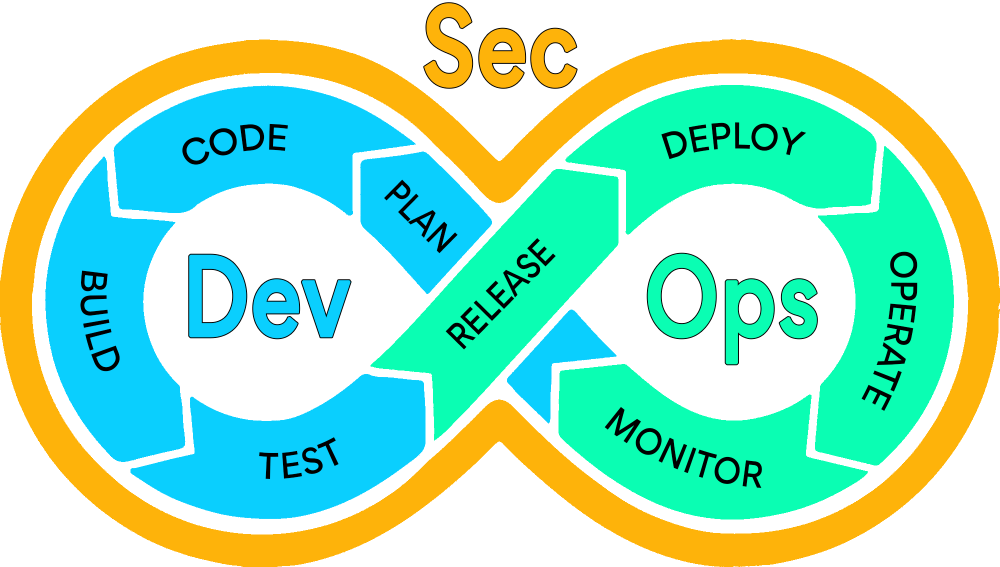

# Introduction 
Les pratiques DevSecOps (Development Security Operations) consistent en une évolution des pratiques DevOps qui met la sécurité des applications ainsi que des infrastructures au cœur de chaque étape, du développement à la mise en production puis à l'opération.

Cette approche consiste notamment à placer la sécurité comme une pratique essentielle durant les phases de développement, mais aussi dans la mise en place d'outils de vérification automatique du code applicatif avant la mise en production, et enfin d'outils vérifiant la sécurité de l'application en production, mais également des infrastructures ; et ce, quel que soit l'environnement.

## Objectifs du DevSecOps
L'objectif premier de cette approche est de réduire au maximum la surface d'attaque exposée à de potentiels acteurs malveillants.

Pour accomplir cet objectif premier, cette pratique peut être découpée en plusieurs sous-objectifs, notamment et de façon non-exhaustive :

- Former les développeurs à délivrer un code plus sûr dès l'écriture
- Garantir une première étape de la sécurité à travers des outils vérifiant le code dès son écriture (extensions dans les Environnement de Développement (IDE) : VScode, JetBrains par exemple)
- Garantir lors des phases de build de l'application ou de l'infrastructure une vérification de la sécurité du code source et conforme à certains standards (outils de SAST - Static Application Security Testing)
- Garantir une fois le build réalisé que l'application dans son état de production ne contient pas de vulnérabilités connues et facilement exploitables (outils de DAST - Dynamic Application Security Testing)
- Utiliser un outil permettant de régulièrement auditer l'application dans chaque environnement pour vérifier la sécurité des accès au réseau ou la présence de CVE au niveau infrastructure ou système d'exploitation
- Garantir la surveillance et la mise en place d'outils de sécurité permettant d'agir rapidement pour contenir une attaque détectée
- Garantir que chaque détection de manquement à la sécurité de l'application ou de son infrastructure fera l'objet d'un changement planifié et sera résolue dans un temps raisonnable, proportionnel au risque de la faille détectée

### L'automatisation, au cœur du DevSecOps
Bien que l'utilité d'une équipe de sécurité soit indiscutable, il parait compliqué de faire reposer à cette équipe l'entière responsabilité de la sécurité de toutes les applications d'une entreprise, de la première ligne de code jusqu'aux mises en production.

Il est donc indispensable d'utiliser des outils d'automatisation afin de faciliter chaque étape du cycle de vie de l'application.

Il existe de nombreux outils d'automatisation, certains Open Source, d'autres avec des licences, ici sera présenté seulement le fonctionnement de ces outils.

## Cycle de vie d'une application dans le DevSecOps
Nous avons vu précédemment les éléments et étapes qui constituent la pratique DevSecOps, cependant, il est nécessaire de s'attarder sur le cycle de vie des applications.

### Plan Initial
Le développement d'application se planifie et s'exécute en suivant un cahier des charges et des spécifications techniques (abrégé "specs" dans le jargon des développeurs).

Le cahier des charges est un document haut niveau qui contient une description non-technique de l'application, le contexte du projet, quelle problématique est adressée, les objectifs, les normes à respecter, les principales fonctionnalités et les responsables du projet et de la sécurité du projet.

Le document des spécifications techniques s'attache à décrire techniquement et le plus précisément possible chaque fonctionnalité de l'application, chaque cas d'usage, l'interface s'il y en a une, etc.

Nous verrons qu'à chaque nouveau cycle de la vie de l'application, il est nécessaire d'établir clairement au moins les spécifications techniques des changements prévus.

### Code
Cette étape consiste à développer l'application ou à l'améliorer afin d'implémenter ce qui est détaillé dans les spécifications techniques attendues.

Il sera nécessaire à chaque nouveau cycle d'appliquer les bonnes pratiques dès cette étape, notamment en termes de sécurité, mais aussi de lisibilité du code source.

### Build & Test
Ces deux étapes dans notre cas sont intimement liées dans le cadre du DevSecOps, il est important qu'à chaque fois qu'une nouvelle version de l'application est développée, elle soit testée automatiquement, d'un point de vue fonctionnel et de la sécurité.

### Release & Deploy
Ces étapes consistent à rendre disponible l'application construite et testée afin d'être ensuite déployée dans des environnements (développement, démo/QA et production par exemple).

### Operate & Monitor
Ces deux étapes représentent le "Ops" de DevSecOps, et sont nécessaires afin d'assurer le bon fonctionnement de l'application en production.

En cas d'incident, qu'il soit causé par l'application elle-même, l'infrastructure ou la sécurité de l'un de ces deux éléments, il est important que cela fasse l'objet d'un plan d'amélioration de l'application ou de son infrastructure.

Ces étapes sont donc cruciales, et de nombreux outils aujourd'hui permettent d'étoffer le monitoring et l'opération.

Une entreprise souhaitera utiliser des outils de surveillances au niveau de l'infrastructure, des systèmes d'exploitation, de l'application elle-même.

Elle pourra faire auditer via du personnel interne ou externe la sécurité de tous les éléments applicatifs ou infrastructure.

### Planification par cycle
De ces différents outils de surveillances découleront des axes d'améliorations, qui seront transformés en spécifications techniques.

Ces dernières permettront aux développeurs de cibler le code nécessitant une amélioration (un "fix" dans le jargon des développeurs)

Évidemment, l'équipe projet peut être amenée à planifier de nouvelles fonctionnalités à implémenter dans l'application en parallèle des améliorations du code existant.

## La parallélisation des cycles
Dans le chapitre précédent, nous parlions de la planification par cycle, ces cycles peuvent être parallélisés afin d'optimiser les phases de développement et accélérer les livraisons de nouvelles fonctionnalités ou améliorations de la sécurité de l'application.

Il est possible de démarrer plusieurs nouveaux cycles de développement en parallèle, et ce, afin de morceler les améliorations opérationnelles et fonctionnelles et de pouvoir exécuter un cycle complet pour chaque modification.

Cela permet de tester individuellement chaque changement, mais également de faire en sorte qu'une amélioration nécessitant plus de temps de développement ou causant des problèmes de sécurité ne bloque la livraison d'une autre amélioration.

Enfin, cela permet à une équipe constituée de plusieurs développeurs de se distribuer des améliorations afin d'augmenter le rythme de livraison de versions de l'application.

Cette parallélisation doit cependant faire l'objet de certaines précautions, notamment en termes de priorités et de dépendances. Il est nécessaire d'ordonnancer les améliorations qui ont des prérequis ou qui sont critiques et demandent une implémentation urgente.

## Conclusion
Le DevSecOps est donc un ensemble de pratiques et d'outils permettant d'améliorer la sécurité d'une application ou d'une infrastructure tout au long de son cycle de vie.

Au-delà de l'aspect technique, elle nécessite une implication humaine de chacun des acteurs du développement et des opérations afin d'assurer la mise en place des meilleures pratiques possible en termes de sécurité.

Enfin, bien que la sécurité soit importante, il est nécessaire de ne pas créer un cadre trop contraignant pour les équipes afin d'éviter les comportements de contournement des règles à haut risque.

Il convient donc de mettre en place le DevSecOps de manière progressive, en formant les équipes, afin d'optimiser la sécurité à tous les niveaux et de ne pas trop freiner le développement applicatif fonctionne