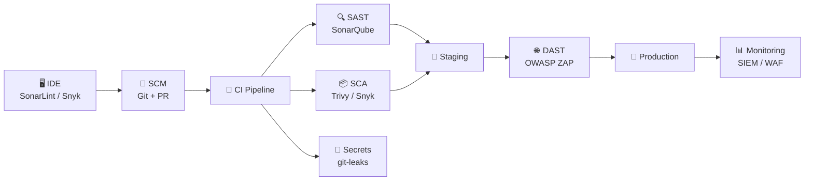
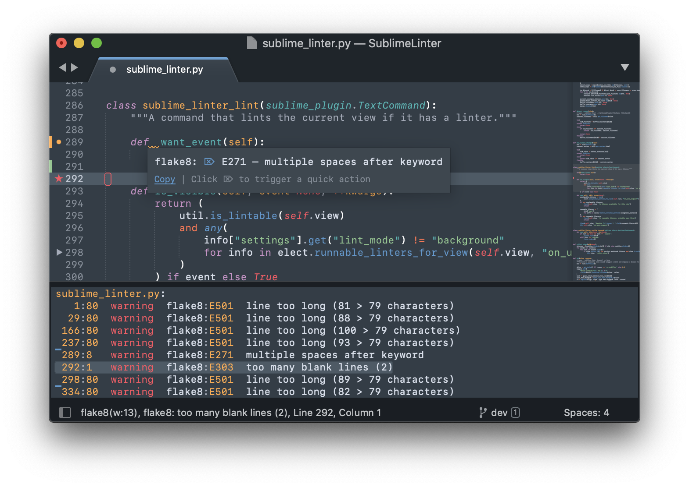

# DevSecOps en pratique

!!! abstract "De la théorie à la pratique"
    Cette page traduit les concepts DevSecOps en **actions concrètes** :
    quels outils intégrer, à quelle étape du pipeline, et comment.

---

## La chaîne outillage DevSecOps



---

## Les 4 types d'analyse de sécurité

=== "SAST — Static Application Security Testing"

    **Analyse le code source** sans l'exécuter.

    | Outil | Langage | Licence |
    |-------|---------|---------|
    | **SonarQube** | Multi-langage | Community / Commercial |
    | **Semgrep** | Multi-langage | Open-source |
    | **Checkmarx** | Multi-langage | Commercial |
    | **Bandit** | Python | Open-source |
    | **ESLint (security)** | JavaScript | Open-source |

    !!! tip "Intégration GitHub Actions"
        ```yaml
        - name: SonarQube Scan
          uses: SonarSource/sonarqube-scan-action@master
          env:
            SONAR_TOKEN: ${{ secrets.SONAR_TOKEN }}
            SONAR_HOST_URL: ${{ secrets.SONAR_HOST_URL }}
        ```

=== "DAST — Dynamic Application Security Testing"

    **Teste l'application en cours d'exécution** en simulant des attaques.

    | Outil | Type | Note |
    |-------|------|------|
    | **OWASP ZAP** | Proxy + Scanner | Open-source, référence |
    | **Burp Suite** | Proxy interactif | Community / Pro |
    | **Nikto** | Scanner web | Open-source |

    !!! example "OWASP ZAP en mode headless (CI)"
        ```bash
        docker run -t owasp/zap2docker-stable zap-baseline.py \
          -t https://mon-app-staging.example.com \
          -r zap-report.html
        ```

=== "SCA — Software Composition Analysis"

    **Analyse les dépendances** (librairies tierces) pour détecter les CVE connues.

    | Outil | Usage | Licence |
    |-------|-------|---------|
    | **Trivy** | Images Docker + filesystem | Open-source |
    | **Snyk** | Code + containers + IaC | Freemium |
    | **OWASP Dependency-Check** | Librairies | Open-source |

    !!! tip "Scanner une image Docker avec Trivy"
        ```bash
        # Installation
        brew install trivy  # macOS
        # ou
        docker run aquasec/trivy image mon-app:latest

        # Scan avec seuil de criticité
        trivy image --exit-code 1 --severity HIGH,CRITICAL mon-app:latest
        ```

=== "Secrets Detection"

    **Détecter les secrets** (clés API, tokens, mots de passe) dans le code.

    | Outil | Intégration |
    |-------|-------------|
    | **Gitleaks** | Pre-commit + CI |
    | **TruffleHog** | Git history |
    | **detect-secrets** | Pre-commit hook |

    !!! danger "Règle d'or"
        Un secret commité dans Git est **compromis** — même si supprimé ensuite.
        L'historique Git conserve tout.

    ```bash
    # Gitleaks — scanner le repo
    gitleaks detect --source . --verbose

    # En pre-commit hook
    gitleaks protect --staged
    ```

---

## Pipeline GitHub Actions complet

```yaml
name: DevSecOps Pipeline

on:
  push:
    branches: [main, develop]
  pull_request:
    branches: [main]

jobs:
  security-scan:
    runs-on: ubuntu-latest
    steps:
      - uses: actions/checkout@v4
        with:
          fetch-depth: 0  # Nécessaire pour gitleaks

      # 1. Détection de secrets
      - name: Gitleaks — Secrets Detection
        uses: gitleaks/gitleaks-action@v2
        env:
          GITHUB_TOKEN: ${{ secrets.GITHUB_TOKEN }}

      # 2. SAST
      - name: SonarQube Scan
        uses: SonarSource/sonarqube-scan-action@master
        env:
          SONAR_TOKEN: ${{ secrets.SONAR_TOKEN }}
          SONAR_HOST_URL: ${{ secrets.SONAR_HOST_URL }}

      # 3. Build de l'image
      - name: Build Docker image
        run: docker build -t mon-app:${{ github.sha }} .

      # 4. SCA — Scan de l'image
      - name: Trivy — Container Scan
        uses: aquasecurity/trivy-action@master
        with:
          image-ref: mon-app:${{ github.sha }}
          exit-code: '1'
          severity: 'CRITICAL,HIGH'
          format: 'sarif'
          output: 'trivy-results.sarif'

      - name: Upload Trivy results to GitHub Security
        uses: github/codeql-action/upload-sarif@v3
        with:
          sarif_file: 'trivy-results.sarif'
```

---

## Bonnes pratiques au quotidien

!!! check "À faire dans chaque équipe"
    - [ ] Installer **SonarLint** dans tous les IDE (feedback immédiat)
    - [ ] Configurer un **pre-commit hook** avec gitleaks
    - [ ] Définir des **Quality Gates** SonarQube bloquants sur les PR
    - [ ] Scanner les images Docker avant tout déploiement (Trivy)
    - [ ] Former les développeurs aux **top 10 OWASP**
    - [ ] Mettre en place un processus de **gestion des CVE** (priorisation)
    - [ ] Réaliser un **pentest** au minimum une fois par an

!!! quote "Principe clé"
    La sécurité ne doit pas être un **frein** au développement.
    Elle doit être invisible quand tout va bien, et claire quand il y a un problème.
    
## Le linting
Parce qu'un code sécurisé est avant tout un code propre, il est nécessaire que chaque développeur ait un outil ou une extension de type "lint" installé dans son éditeur de code (IDE - Integrated Development Environment).

Cet outil permettra notamment de détecter de nombreux problèmes de syntaxe basiques :

- Variables ou fonctions inexistantes
- Variables ou fonctions inutilisées
- Problèmes de syntaxe
- Doubles déclarations
- Non-conformité avec les "best practices" du langage (PEP8 ou PEP20 en Python, etc.)
- Problèmes récurrents connus pour poser problème au compilateur si ce langage est compilé

Il existe des outils de linting pour presque chaque langage dans tous les IDE. Certains IDE intègrent par défaut ces outils lorsqu'ils sont spécialisés sur un langage en particulier (IntelliJ pour Java avec ESLint par exemple).



On retrouvera souvent un linter dans le pipeline en première étape afin de remonter les erreurs aux développeurs si certaines ont pu être oubliées.

Ceci permettra dans certains cas de bloquer l'avancée du pipeline si des erreurs de syntaxes affectant la sécurité sont trouvées.

## Le Static Application Security Testing
Cet outil, souvent nommé SAST, est en charge de trouver et faire remonter les vulnérabilités du code source.

Il peut dans certains cas faire remonter des failles de sécurité potentielles telles que :

- Non-validation des paramètres d'entrée (saisies des utilisateurs ou variables passées entre les fonctions)
- Permissions accordées trop larges
- Ouverture des accès au réseau trop larges
- Sensibilité aux attaques les plus communes (Injection SQL, XSS etc.)
- etc.

Chaque outil SAST est adapté à un ou plusieurs langages et permettra pour chaque langage un éventail de détections possible. Référez-vous à la documentation officielle de l'outil choisi pour avoir la liste complète des possibilités.

Ces failles de vulnérabilités sont - dans la plupart des outils - classées selon une criticité : Info, Low, Medium, High, Critical permettant aux équipes de se situer vis à vis de la sécurité du code source et des failles à corriger en priorité.

Il existe de nombreux outils SAST adaptés à chaque usage, très peu sur le marché couvrent tous les langages. Il sera donc nécessaire d'utiliser l'outil correspondant à l'usage, par exemple :

- Semgrep pour le code applicatif (Python, Go, Javascript, etc.)
- KICS (Keep Infrastructure Code Secure) pour le code infrastructure (Ansible, Dockerfile, Terraform, etc.)

Il s'utilise en général juste après une étape de lint et avant toute compilation ou déploiement. Il est supposé couper l'exécution du pipeline en cas de faille trouvée ayant une criticité supérieure ou égale au niveau choisi (par exemple arrêter l'exécution en cas de High ou en cas de Critical).

## Le Dynamic Application Security Testing
Le DAST est un outil permettant d'effectuer des tests de sécurité en "boîte opaque", donc sans connaissance du fonctionnement ou du code source.

Il s'exécute une fois l'application déployée dans un environnement proche de celui de production.

Il permet par exemple, en donnant l'URL de l'application Web ou bien l'IP et le port du service à tester, de tester les failles les plus communes auxquelles l'application est sensible, par exemple les 10 catégories d'attaques représentant le plus de risque de sécurité selon l'OWASP (OWASP : Open Web Application Security Project).

Les tests effectués par un outil DAST permettent ensuite d'avoir un rapport détaillé de toutes les failles détectées et classées selon leur criticité, en général : Info, Low, Medium, High, Critical


## L'Interactive Application Security Testing
Le IAST représente les outils capables de combiner les capacités d'un SAST et d'un DAST afin d'analyser d'un côté le code source et de l'autre, l'application, une fois déployée et de pouvoir établir des corrélations et des suggestions entre les deux.

## Les Pipelines
Les outils d'analyse doivent être exécutés de façon séquentielle et automatiquement lorsqu'une nouvelle version du code source est envoyée sur le dépôt git.

Cette pratique d'automatisation prend place au sein d'une chaîne d'intégration et de déploiement continus nommé couramment une chaîne CI/CD (Continuous Integration/Continuous Deployment).

Le pipeline CI/CD est un outil qui, à l'aide d'un fichier descriptif, va exécuter des étapes séquentielles dans un environnement temporaire de développement permettant par exemple de :

- Cloner le dépôt git
- Linter le code source
- Exécuter un outil de SAST sur le code source
- Compiler le code source en application
- Faire des tests unitaires et fonctionnels sur l'application compilée
- Déployer l'application dans un environnement similaire à la production
- Lancer l'exécution d'un outil de DAST sur le point d'entrée applicatif
- Générer un rapport de chacune des étapes précédentes dans un format lisible
- Stocker le rapport dans un dossier distant
- Mettre à disposition l'archive contenant l'application compilée en tant qu'artefact de le pipeline.

Plusieurs pipelines peuvent s'enchaîner et dans le cas ci-dessus, le suivant pourrait être en charge de déployer l'application dans un environnement de démo ou de QA (Quality Assurance - Contrôle qualité) afin de tester de façon manuelle et humaine l'application avant sa mise en production.

Il est également possible dans la plupart des outils de pipeline de mettre en "pause" des exécutions ou d'attendre une intervention humaine. Par exemple, une fois l'étape de contrôle qualité humaine réalisée, une pipeline finale pourrait attendre une approbation d'un chef de projet afin de lancer la mise en production automatique de l'application.

