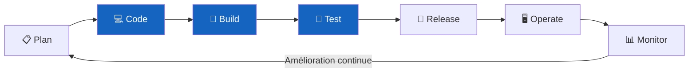

# DevSecOps

!!! abstract "En une phrase"
    Le DevSecOps intègre la **sécurité** comme une pratique essentielle à **chaque étape**
    du cycle de développement, de l'écriture du code jusqu'à la production.

-   :material-shield-lock:{ .lg .middle } **Culture & Introduction**

    ---

    Objectifs, cycle de vie applicatif, automatisation et parallélisation des cycles.

    [:octicons-arrow-right-24: Lire](Culture/introduction.md)

-   :material-cog-play:{ .lg .middle } **En pratique**

    ---

    Mise en œuvre concrète du DevSecOps dans les équipes et les pipelines.

    [:octicons-arrow-right-24: Lire](Culture/pratique.md)

## Le cycle DevSecOps

| Phase | Outil type | Objectif sécurité |
|-------|-----------|-------------------|
| Code | Extensions IDE (SonarLint) | Détection en temps réel |
| Build | SAST (SonarQube) | Analyse statique du code source |
| Test | DAST (OWASP ZAP) | Test de l'application en cours d'exécution |
| Release | SCA (Trivy, Snyk) | Audit des dépendances & images |
| Operate | SIEM, WAF | Surveillance et réponse à incident |
