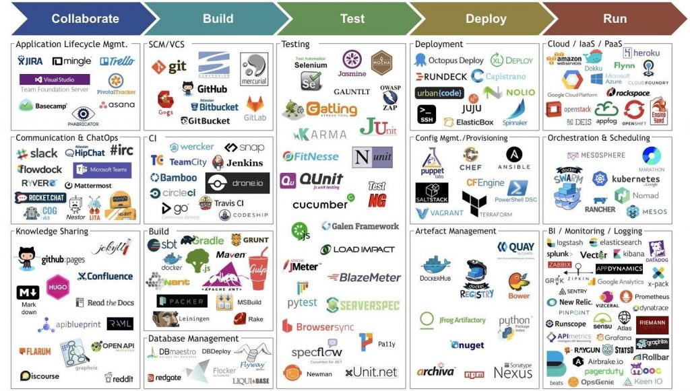
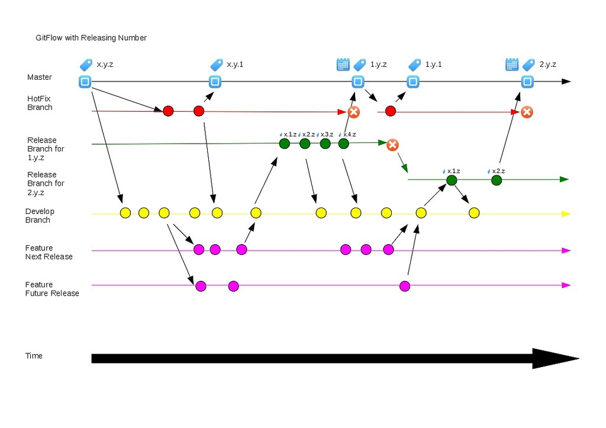
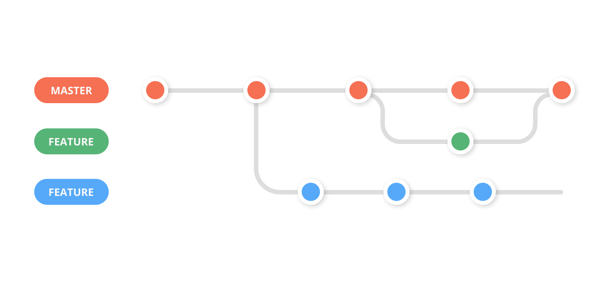
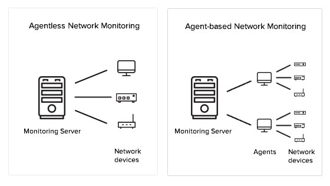

    1. Introduction devops 

Devops = industrialisation de l"IT 
    
Née en 2009 par patrick debois , c'est un mouvement est une extension de la méthodologie Agiles ( Scrum, Kaban ) 

    2. Pipeline Devops 
                    

Outils : jira , git 
Plan  : 
      -   Cadrage fonctionnelle technique 
    - Gestion du backlog 
    - Préparation des us du sprint 

Code

    3. Build  
    
Livrable à partir du code 

    4. Tests 

    - Test fonctionnelle TNR UAT 
    - Test de performance : E2E , Intégration Tests , unit test ( cost ---> $$$) ( inté ---> isolation  ) 
Test unitaire : plus bas niveaux ,  
Test d'intégration : test avec livrable complet , chargé tout et tout tester , 
End 2 end : scenario vérif tout fonctionne 

    5. Release 

Gestion des versions applicative :
    - Snapshots : version de travail 
    - Releases : ensemble de features et fixes ( on peut pas le rebuild ) 
    
Sémantique : ex 1.2.3 

    - Majeur : Evolution rétrocompatibles 
    - Mineur: Mineur Rétrocompatible   
    - Correctif: Patch anomalie 
    
    6. Deploy  

Livraison en production : 
    - FDR , feuille de route ( etape de livraison , acteurs , durée , planning ) 
    - Process rollback 

    7. Operate ( exploitation ) 

Phase de gestion de l'application en production, équipe dédié ( helpdesk ) astreinte h24 

    8. Monitor ( prometeus , elastick, logstash , Kibana alias elk  ) 

Phase de surveillance de l'application et des process ; monitor de prod ( faille , log , secu , perf ) , recuille avis cliens , stats projet ( time to market , bottleneck )  

    ------------------------------------------------------------------------------------------------------------------------------------------
    9. Objectif devops 

    - CI Continous inté 
    - Continous testing 
    - Continious delivery 
    - CD continious deployment 

    

    10. DevOps & Scrum  

Image cycle devops en scrum inté CI / CD 

    11. Intérêt approche devops 

Tout automatisé , meilleur qualité de production ,fiabilité de déploiement , résolution incident plus rapide . 

Meilleur time to market 

II - les outils devops 

    1. Git 

Gestion , collab , fusion de code 

PR : call request 
MR : merge request

Git flow : 

Tag git : on tag sur la branche release  , on tag les version qui monte en production , tag zippé on purge les branche mais pas les tag 

Git merge : Fusion de branche ( quand on est sur une release   ) 
Git rebase : Transfere de commit d'une branche A vers B 
Git squash ; tout les commit en un 
Commit nn : fusion de 2 commit 

Master : branche de prod 
 develop : branche d'integration 
Feature : la branche pour les nouvelles feature 
Relesases : branche des nouvelles versions du produit 
Hotfix : les fix sur la prod 
Fix : les fix sur les autres branches  : 

2 - Jenkins , serveur d'automatisation CI/CD 

Plein de plugin des differente etape de CI/CD , ansible terraform 

Jenkins, pipeline : 

    - Pipeline est une suite de tache d'indus et a automat process ci ct cd 
    - Langage groovy 

Notions:
    - Agent/node , représente un envi  pouvant exec une machine esclave (pipeline) 
    - Tools permet de def les version outils utilisé par le script 
    - Stage représente ensemble étape 
    - Step action a réalisé comme le git checkout 

2type de pipeline , scripted et déclarative 

  III-  IaC infra as code 

    - Decrire son infra 
    - Gestion et approvi
    - Automatisation 
    - Réduction des disparité entre les environnement de prod et dev 
    - Cloud 
    - Versioning 
    
    1. IAC Terraform 

CLI pour utilisé des ressources des provides de cloud ( AWS , Openstack, azure …. ) 
Déclaration de l'ensemble des ressources qui seront utilisé ( langage déclaratif (HCL/JSON)) 

Harshicorp => Vault 

Terraform Provider 

Terra ressource : 
    - Element le plus important de terra
    - Chaque ressource représente un Object d'infra  

Terraform datasource : 
    - Recuperer des informations en provenances du cloud provider , de l'infra 
    - Elle peuvent etre reutilisé dans les ressources 

Terraform variables : 

Terraform project structure 

    2. IAC AWS 

AWS : 
    - Leader tout type de cloud 
    - Cloud vs legacy : pas d'investissement , pay as you go , horizontal / vertical scalling / auto scalling 

Horizontal scalling : + de RAM + de CPU
Vertical : +nœud ( serve ou VM en plus  ) 
AutoScalling :( impossible d'autoscale Base de donnée ) 

AWS Schema 

    3. Configuration as Code /  CaC

    - Config du système 
    - Config de l'application 
    - Automatisation 
    - Réduction de dispartité entre les environnement prod et de dev 
    - Versioning 
    - Différence de L'iac ( Provisioning vs Configuration ) 

Outils CaC : ansible 
    - Agentless : pas besoin d'agent pour lancer des outils , y'a un controller qui gere tout et des machine qui subisse la conf 
    - Idempotence: assure que tout s'exécute de manière iso et toujours donc 0 aléa , chaque job sera le meme 
    - Language déclaratif : yaml ( on donne le resultat qu'on souhaite et on la  ) 

Role ansible : 
/common 
    - task : toutes les taches 
    - Handlers : systemd linux , 
    - Files : fichier-plat ( exemple fichier shell ) 
    - Templates : fichier plat avec des template 
    - Vars : variable unique 
    - Vault: variable changeable 
    - Meta : meta donnée 

/webservers  ( obligatoire  ) 
    - Tasks 
    - Meta 

https://www.jenkins.io/doc/tutorials/

DEVOPS 
https://www.jenkins.io/doc/book/pipeline/
https://www.jenkins.io/doc/book/pipeline/syntax/
Pipeline
https://testautomationu.applitools.com/jenkins-tutorial/chapter3.6.html
Git flow 
https://danielkummer.github.io/git-flow-cheatsheet/index.fr_FR.html
Groovy 
https://www.eficode.com/blog/jenkins-groovy-tutorial
IAC google
https://cloud.google.com/architecture/managing-infrastructure-as-code-with-terraform-jenkins-and-gitops#setting_up_your_github_repository
IAC 
https://medium.com/@pb8226/running-terraform-with-jenkins-pipelines-f29a8cb861d4
Job jenkins 
https://d3vpasha.wordpress.com/2019/01/05/importer-un-job-jenkins/

