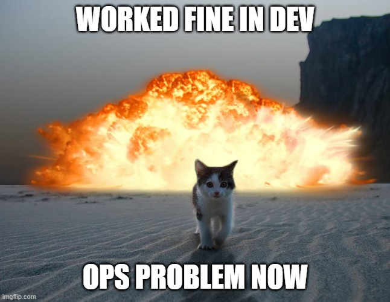
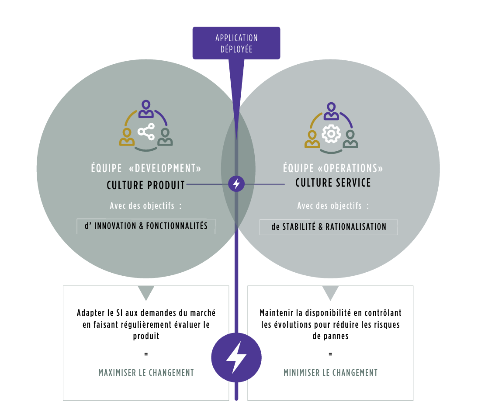

## Introduction 
Le DevOps est une approche qui concilie le développement et les opérations. Initialement utilisée dans le domaine du développement logiciel, elle s’est également répandue dans la Data Science et le Machine Learning. 

Le terme DevOps est la contraction des mots “développement” et “opérations”. 
Il s’agit d’une pratique visant à répondre aux  besoins des développeur de livrer rapidement en production et des opérationnelle d'assurer l’assurance qualité. 

Le DevOps n'est ni un métier ni un framework. C'est une démarche qui est devenue une philosophie qui vise à briser le silo entre les équipes en charge du développement des applications, les Dev et celles en charge des infrastructures, les Ops. 

Le DevOps est une extension naturelle des méthodes agiles (SCRUM, KABAN)

## Être agile

La fourniture rapide, fiable et pertinente de services IT est devenue, quel que soit le secteur d’activité, une composante essentielle de la compétitivité des entreprises. Pour gagner en réactivité, sans pour autant perdre en fiabilité et qualité, les grandes structures doivent transformer en profondeur leurs pratiques sur tout le cycle de production IT, de la conception au déploiement. 

Cette transformation est déjà bien entamée à travers la démocratisation des 
méthodologies agiles, comme Scrum, qui a permis d’accélérer et d’augmenter le 
nombre de livraisons applicatives. 

Pour autant, freiné par des temps de livraison en production trop longs, ces méthodes ne tiennent pas encore toutes leurs promesses. Pour vraiment améliorer le time-to-value, c’est-à-dire le temps entre l’expression du besoin du métier et l’ouverture du service idoine, c’est l’intégralité de la chaîne de valeur IT, du métier aux opérations, qui doit être transformée. 

La démarche DevOps étend les pratiques agiles venues du développement au passage 
en production pour bénéficier pleinement de l’accélération des livraisons applicatives.

## Time To value 

Le DevOps est une démarche d‘alignement des parties prenantes de la chaîne 
de valeur IT (business, développement, opérations mais aussi sécurité, 
architecture, compliance et autres fonctions transverses) sur un objectif métier 
commun, dans le but d’accroître la réactivité de l’entreprise sur son marché.

Cette démarche se matérialise par un ensemble de bonnes pratiques, méthodologies et outils qui servent deux objectifs :
- Aligner les objectifs entre Dev et Ops
- Automatiser l’ensemble du cycle de production

## Le Mur de la Confusion
Dans les entreprises traditionnelles, on trouve généralement deux équipes principales au sein du département IT: l'équipe de développement (Dev Team) et l'équipe des opérations (Ops Team).

La Dev Team a pour mission de développer le produit souhaité par le client. Soucieux de la performance et de la qualité du produit, ainsi que des spécifications du client, et souvent désireux d'essayer les dernières technologies du marché, les développeurs proposent fréquemment des solutions nécessitant l'installation de nouveaux logiciels (bases de données, systèmes de messagerie, conteneurs, etc.), de nouveaux serveurs, ou de nouveaux systèmes d'exploitation.

En revanche, la mission de l'Ops Team est de garantir un certain niveau de performance, de stabilité et de fiabilité de la solution fournie au client. Par conséquent, l'Ops Team est souvent très réticente aux changements. Elle peut même s'opposer à toute modification d'infrastructure, à l'installation de nouveaux produits ou à l'utilisation de nouveaux systèmes pour éviter tout risque d'instabilité ou de régression des performances.

Ces deux philosophies entrent souvent en conflit, créant une atmosphère de travail tendue au sein de l'entreprise. Ce conflit est communément appelé le "Mur de la Confusion".

D'un côté, les développeurs poussent pour faire évoluer la technologie utilisée et adopter de nouvelles procédures. De l'autre, les équipes d'opérations insistent pour maintenir la stabilité des systèmes et garantir un certain niveau de performance.

Dans les deux cas, l'objectif reste la satisfaction du client. Sans l'approbation du client, un projet peut rapidement devenir non rentable. La situation financière de l'entreprise peut alors se détériorer, créant une ambiance de travail insupportable. Les commerciaux veulent répondre aux demandes des clients, les développeurs cherchent à implémenter les meilleures solutions, et les opérations se concentrent sur la stabilité et la fiabilité, parfois au détriment de la rapidité ou de la simplicité.

Ce conflit peut entraîner des retards de livraison importants, voire des pénalités, entraînant des pertes financières conséquentes pour l'entreprise.

Aujourd'hui, la collaboration entre les équipes de développement et d'opérations reste souvent difficile. Leurs missions respectives – innovation, évolution et réactivité pour les Devs, stabilité et fiabilité pour les Ops – semblent a priori peu compatibles. Cette interdépendance complexe peut nuire à la performance et générer une frustration mutuelle. Les méthodologies agiles, bien qu'efficaces dans de nombreux contextes, n'ont pas toujours résolu ce problème, souvent en raison d'une implication insuffisante des équipes d'exploitation. L'accélération du rythme de livraison applicative et la philosophie "test & learn" peuvent même accentuer le fossé. Les équipes d'exploitation doivent déployer en production un nombre croissant d'évolutions, souvent avec une augmentation des taux d'erreurs, alors que l'exigence de fiabilité reste constante. Cela crée non seulement un goulot d'étranglement au niveau de la production, mais aussi des frictions accrues entre les équipes de développement et d'exploitation.

Les pratiques et outils DevOps offrent une solution en intégrant l'ensemble des acteurs de la chaîne de valeur IT au sein d'un processus unique, intégré et continu, reposant sur des principes agiles (itérations, forte collaboration business, test & learn) et une véritable culture de la collaboration entre les Devs et les Ops.

## Automatiser l'ensemble du cycle de production
Le DevOps repose également sur la mise en place d'outils d'automatisation couvrant tout le cycle de production IT : automatisation de la fourniture d'infrastructure, de la construction applicative, des tests et du déploiement applicatif. Cette automatisation permet d'absorber l'augmentation du volume et du rythme des tests itératifs, garantissant ainsi la qualité du code applicatif à chaque itération sans créer de goulot d'étranglement en aval.

En adoptant les pratiques DevOps, les entreprises peuvent surmonter le Mur de la Confusion et améliorer la collaboration entre les équipes de développement et d'opérations, tout en assurant la satisfaction du client.

# Ressources
https://devopscube.com/become-devops-engineer/