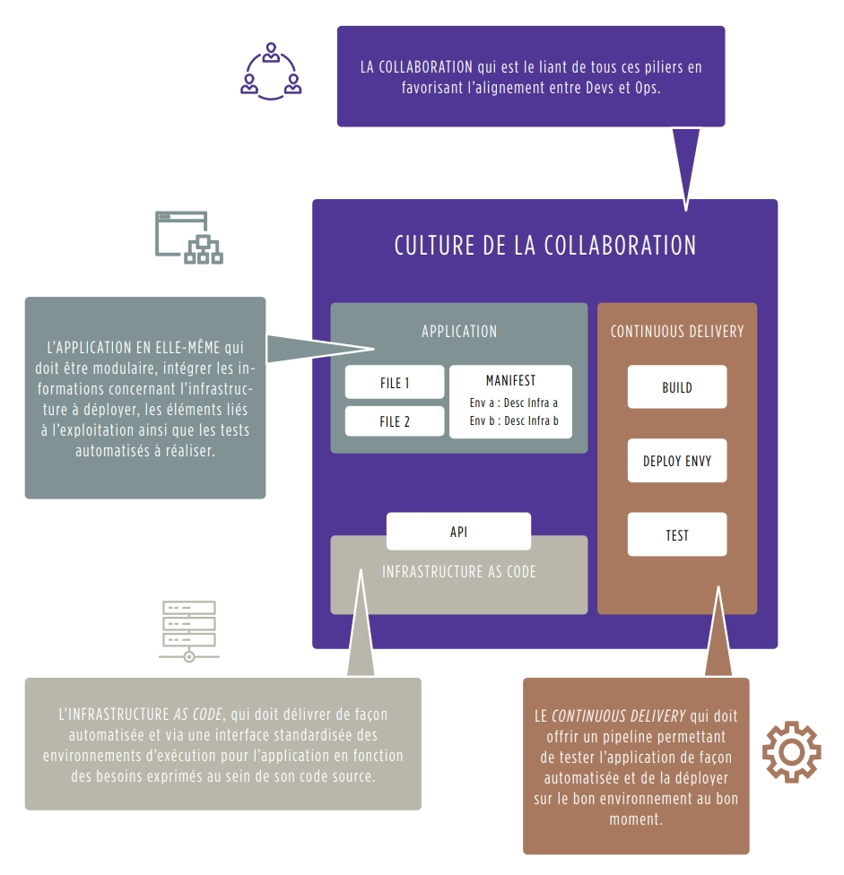
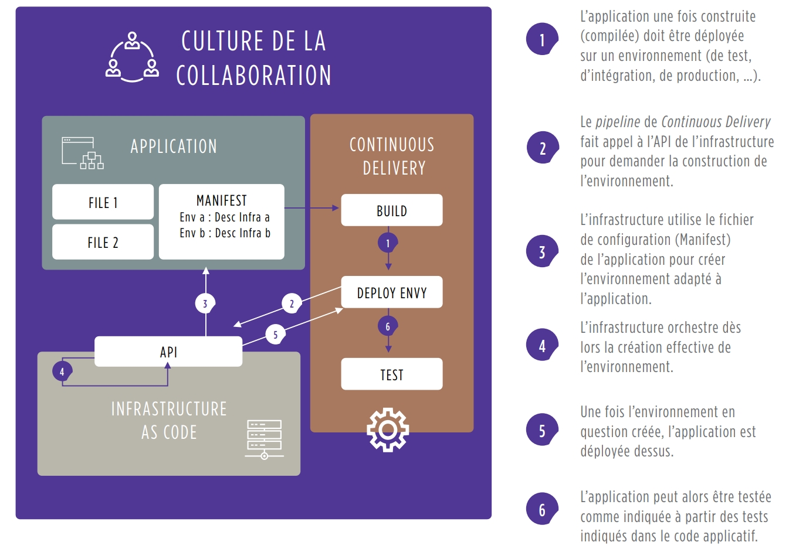

### L'automatisation peut se décliner dans 3 composantes 

DevOps, il est nécessaire de travailler sur 4 axes en parallèle, qui constituent les 4 piliers du DevOps :
- L’Application : préparer la transformation des applications en les rendant modulaires et automatisables
- Le Continuous Delivery : automatiser la chaîne de livraison de la phase de développement à la mise en production
- L’Infrastructure as Code : tendre vers une infrastructure service consommable, puis intégrable à la 
livraison applicative
- La Collaboration : changer la culture et les pratiques pour tendre vers une organisation sans silos et tirée par des méthodologies agiles

