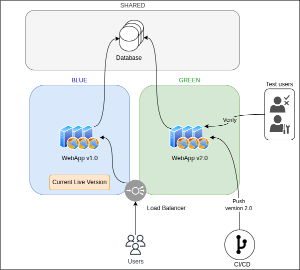
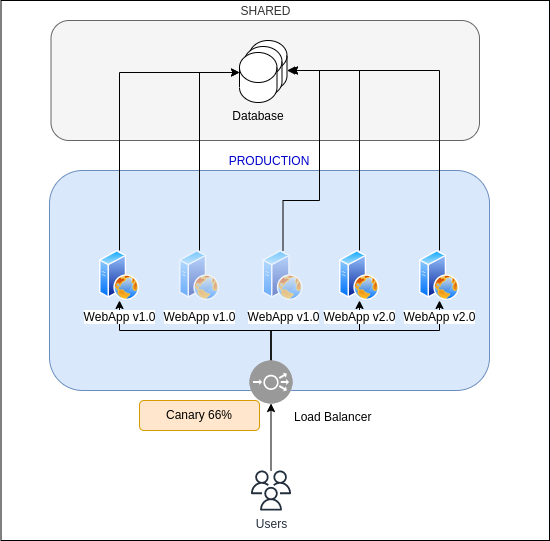
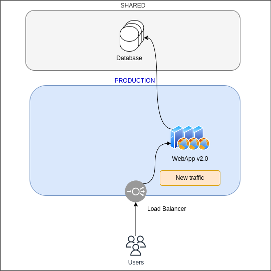

# Déploiement sans interruption
Le déploiement continu (CI/CD) nécessite de pouvoir déployer les nouvelles versions de l'application sans pour autant impacter les utilisateurs finaux.

De nos jours, les applications sont de plus en plus exposées de façon internationale, ce qui rend les phases de maintenances où elle n'est pas du tout accessible : critique au bon déroulement des affaires des entreprises.

Heureusement, il existe plusieurs types de déploiements permettant de mettre à jour la version d'une application dans son environnement de production sans devoir couper l'accès aux utilisateurs :

- Le déploiement Blue-Green
- Le déploiement Canary
- Le déploiement Rolling
Ces déploiements nécessitent que la partie hébergeant les données soit séparée de l'application afin de pouvoir avoir deux environnements identiques en parallèle utilisant le même jeu de données.

 

## Blue-Green
Le déploiement Blue-Green (ndlr. Bleu-Vert en Français) consiste à utiliser en permanence deux environnements de production, un que l'on considère Bleu/Blue et l'autre que l'on considère Vert/Green.

Dans son état "initial", l'application a la même version (1.0) dans les deux environnements.

Comme indiqué par le bandeau "Current Live Version", actuellement, les Utilisateurs qui passent par un équilibreur de charge (Load Balancer) pour accéder à l'application, sont redirigés par ce dernier sur les serveurs dans Bleu/Blue.

Puis lorsqu'une nouvelle version (2.0) est livrée, elle est déployée à l'aide de la chaîne CI/CD dans l'environnement Vert/Green.

Une fois ce déploiement terminé, une équipe de test vérifie le comportement de la version 2.0 dans son environnement de production afin de s'assurer que l'application est prête à recevoir le trafic.

Dernière étape, la destination sur l'équilibreur de charge est modifiée afin de rediriger les utilisateurs vers l'environnement Vert/Green et donc la nouvelle version.

ℹ️ À noter qu'il est intéressant après chaque mise à jour de faire monter en version l'environnement qui n'est pas actuellement servi aux utilisateurs, et ce, afin d'avoir une solution de secours en cas d'incidents sur l'environnement "live".

⚠️ Attention : ce type de déploiement nécessite des précautions, notamment en termes de sessions en cours, un utilisateur étant en train d'utiliser l'application sur Bleu durant la migration pourrait (suivant le fonctionnement de l'application) perdre le travail non enregistré (non encore écrit dans la base de données).

Il est tout à fait possible d'utiliser un équilibreur de charge par environnement, la migration pourra se faire à l'aide d'un changement de la cible de l'enregistrement DNS (Domain Name Server) de l'application.

 

## Canary
Ce type de déploiement fonctionne de manière similaire au déploiement Blue-Green, c'est la méthode qui est différente puisqu'au lieu de dupliquer entièrement l'environnement, seuls une partie des serveurs constituant le service ou l'application sont mis à jour.

Dans le diagramme Blue-Green, nous avions plusieurs serveurs dans Blue qui se répartissaient le trafic de la WebApp v1.0. Dans le déploiement Canary, on indique à notre équilibreur de charge d'ignorer l'un des serveurs qui sera la cible de la CI/CD pour le déploiement des nouvelles versions.

Lorsque l'on souhaite mettre à jour la version de l'application, la CI/CD déploie la nouvelle version sur le serveur isolé et on indique à l'équilibreur de charge de créer une route spéciale avec certaines conditions (par exemple l'IP source ou un nom de domaine différent) permettant aux utilisateurs de tests de vérifier la stabilité de la nouvelle version.

Une fois la vérification effectuée, on se sert de ce serveur supplémentaire ayant déjà été mis à jour pour effectuer une rotation progressive du déploiement de la nouvelle version sur les serveurs.

Les déploiements Canary sont souvent exprimés en pourcentages, 2 %, 25 %, 50 % etc. Ce pourcentage dépend du nombre de serveurs initial et de la proportion de serveurs étant déjà mis à jour en tant que cible de l'équilibreur de charge.

Ainsi, un déploiement Canary 25 % indique qu'un quart des serveurs hébergeant l'application servent aux utilisateurs la nouvelle version.

Dans notre cas, nous allons utiliser 3 phases :

- 25%
- 66%
- 100%
 

25%
Ici, le serveur ayant reçu la version 2.0 est intégré à l'équilibreur de charge, et l'un des serveurs en 1.0 est détaché et ne reçoit plus de trafic afin d'être mis à jour. La proportion de serveur ayant la version 2.0 est donc de 1 sur 4 soit 25 %.

 

66 %
Le serveur ayant reçu sa mise à jour est réintégré en destination de l'équilibreur de charge, on détache également 2 serveurs afin de déployer la nouvelle version, nous avons donc une proportion de 2 serveurs sur 3 présentant la version 2.0 aux utilisateurs soit 66 %.

 

100 %
Ici, sont réintégrés les 2 serveurs ayant reçu la mise à jour de version, et le dernier serveur (qui deviendra celui de la cible de la pipeline CI/CD pour le cycle suivant) est détaché et mis à jour et restera détaché.

Nous obtenons donc 4 sur 4 serveurs qui présentant la version 2.0 aux utilisateurs, soit 100 %.

 

Remarques à propos de Canary
Il existe plusieurs méthodes pour faire du déploiement Canary. Celle présentée est classique, mais il est tout à fait possible d'effectuer cette migration à l'aide d'enregistrements DNS pondérés permettant d'envoyer une partie du trafic à un groupe de serveurs déjà à jour et en basculant petit à petit les utilisateurs d'un groupe à l'autre.

Enfin, cette migration par équilibreur de charge demande un bon niveau d'automatisation dans la mesure où elle nécessite des opérations répétées de sortir des serveurs pour qu'ils reçoivent la nouvelle version puis les rentrer à nouveaux, ce qui peut causer des erreurs ou des incidents.

 

## Rolling
Dans le cadre d'un déploiement Rolling, on ajoute de nouveaux serveurs ayant déjà la nouvelle version dans le cluster, puis une fois prêts, on bascule via l'équilibreur de charge le trafic d'un groupe à l'autre.

À l'état initial, l'application consiste en un groupe de 3 serveurs derrière l'équilibreur de charge.

On lance ensuite le déploiement de 3 nouveaux serveurs contenant la version 2.0.

Dans le cadre d'un déploiement Rolling, il est recommandé de déléguer la vérification des nouveaux serveurs à des "healthcheck" effectués par l'équilibreur de charge afin de vérifier l'état du service cible.

Lorsque le nouveau groupe est disponible, on indique à l'équilibreur de charge - s'il le supporte - d'envoyer toutes les nouvelles connections d'utilisateurs vers le groupe ayant la version 2.0 et de ne garder que les sessions TCP encore actives sur le groupe de la v1.0. Cette étape est communément appelée "draining" (drainage).

Enfin, lorsqu'il n'y a plus de sessions actives sur l'ancienne version, on indique à l'équilibreur de charge de déclencher l'extinction des serveurs de la version 1.0 afin de ne garder que le groupe ayant la nouvelle version.

Le déploiement Rolling est donc une combinaison entre Blue-Green et Canary puisqu'elle permet de faire une bascule en créant un environnement similaire et temporaire, et de migrer les utilisateurs d'une version à l'autre de façon progressive.

Cette méthode de déploiement est proposée par défaut par certains Cloud Provider qui ont des services d'équilibreurs de charge gérés incluant toutes les fonctionnalités nécessaires pour ces déploiements.

 

## Combinaison des déploiements
Aucune des méthodes de déploiement précédemment citées n'empêchent l'utilisation d'autres méthodes.

Il est donc courant d'alterner ou d'en combiner certaines afin de s'adapter à la criticité de la mise à jour à déployer, la quantité de vérification à effectuer et le nombre de serveurs à mettre à jour.

Chaque équipe est responsable d'étudier son plan de déploiement pour chaque cycle DevOps et d'utiliser la méthode de déploiement la plus adaptée.

 