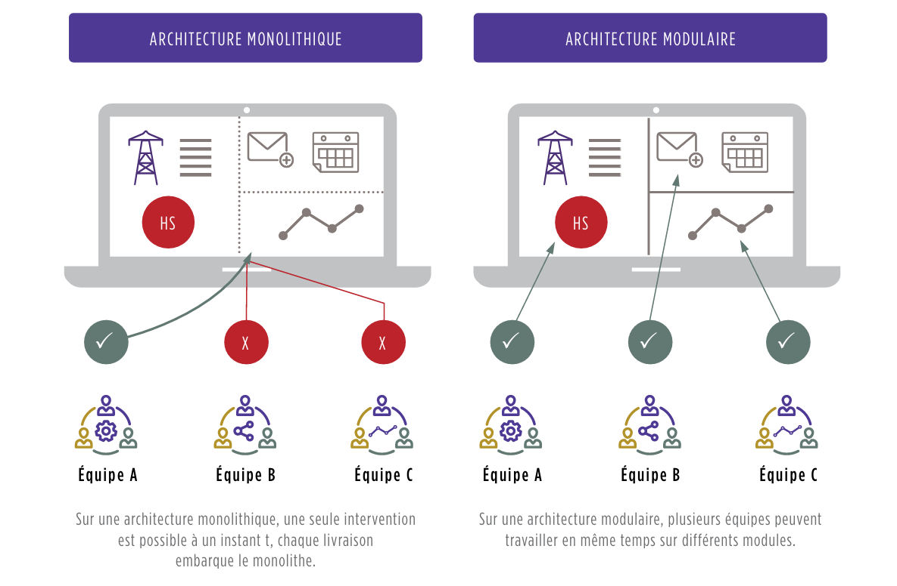

### L'automatisation peut se décliner dans 3 composantes 

DevOps, il est nécessaire de travailler sur 4 axes en parallèle, qui constituent les 4 piliers du DevOps :

- L’Application : préparer la transformation des applications en les rendant modulaires et automatisables
- Le Continuous Delivery : automatiser la chaîne de livraison de la phase de développement à la mise en production
- L’Infrastructure as Code : tendre vers une infrastructure service consommable, puis intégrable à la 
livraison applicative
- La Collaboration : changer la culture et les pratiques pour tendre vers une organisation sans silos et tirée par des méthodologies agiles

## Pilier I : Des applications modulaires et faiblement couplées entre elles

### Une architecture nécessairement plus modulaire

Être plus agile implique de livrer de nouvelles versions applicatives plus souvent en répartissant le travail sur plusieurs équipes (petites et pluridisciplinaires, des "feature teams"). Cela nécessite de découpler leur travail pour plus d'efficacité et donc d'utiliser des architectures applicatives plus modulaires.

### Architecture monolithique vs modulaire

- **Architecture monolithique** : Une seule intervention est possible à un instant t, chaque livraison embarque le monolithe.
- **Architecture modulaire** : Plusieurs équipes peuvent travailler en même temps sur différents modules. Les échanges entre modules sont standardisés et s'appuient sur des interfaces (API) permettant de les découpler.

### Le cas des micro-services

L'architecture micro-service offre une réponse à un besoin d'extrême scalabilité de fonctions précises d'un système. Dans une logique de décomposition d'un périmètre fonctionnel en services à fine maille autonomes mais collaborant entre eux, les pratiques d'architecture, d'infrastructure et d'exploitation doivent évoluer pour gérer une constellation de micro-services instanciables à la volée et volatiles.

### Faible couplage à tous les niveaux

Les éléments constituants l'application doivent être très faiblement couplés, et ceci à tous les niveaux :

- Vis-à-vis de framework ou de bibliothèques.
- Entre modules de l'application et vis-à-vis de l'extérieur pour simplifier la réalisation de tests.
- Vis-à-vis de l'interface utilisateur.
- Vis-à-vis de la persistance des données.
- Vis-à-vis de toute autre fonction externe à l'application issue d'autres applications ou services.

### Mise en production rapide et maîtrisée

La conception d'applications en mode DevOps nécessite de renforcer les tests réalisés (notamment par leur automatisation) et de prendre plus de risques dans les mises en production. Cela signifie une évolution des méthodes de développement et l'introduction de nouvelles démarches comme le "Test Driven Development", le "Feature Flipping" ou le "Blue-Green Deployment" pour mettre en production, partiellement ou de façon ciblée, certaines fonctionnalités.

### Tests unitaires : L'approche Test-Driven Development

Avec une approche Test Driven Development, le développeur :

1. Écrit le code source du test unitaire relatif à la fonctionnalité à développer.
2. Écrit le code source de la fonctionnalité permettant de passer le test.
3. Retravaille le code pour l'améliorer tout en s'assurant que le test continue de passer.

### Méthodes de déploiement

- **Blue/Green Deployment** : Déploiement d'une version n+1 sur un environnement parallèle à la version de production n et bascule facilitée de n vers n+1 et de n+1 vers n (rollback).
- **Canary Release** : Déploiement de plusieurs versions en parallèle, certaines versions ne sont ouvertes qu'à certaines populations avant d'être généralisées.
- **A/B Testing** : Déploiement de deux variantes d'une même version en parallèle pour en comparer les résultats.
- **Feature Flipping** : Déploiement de fonctionnalités activables via une interface de l'application.

[Plus d'information dans la section déploiement](../Deploiement//introduction.md)

### Automatisation des tests fonctionnels

Les tests fonctionnels doivent être largement automatisés pour vérifier l'absence de régressions fonctionnelles à chaque itération et valider le bon comportement des fonctions nouvellement créées ou modifiées.

### La dette technique

La construction plus rapide d'une application amène à faire des compromis, contractant ainsi une dette technique que l'on rembourse tout au long de la vie du projet. Il n'est pas utile de chercher à atteindre le zéro dette, mais il est important de la maintenir sous contrôle.

### Anonymisation des données

Dans certains secteurs, le besoin d'anonymisation des données devient de plus en plus prononcé. La mise en place du DevOps doit inclure la capacité d'automatisation de l'anonymisation des données de production utilisées pour les tests fonctionnels.

## Pilier II : Le Continuous Delivery pour des livraisons auto-magiques

### Qu'est-ce que le Continuous Delivery ?

Le Continuous Delivery (CD) est une chaîne de construction logicielle automatisée. Il s'agit d'un ensemble de processus, outils et techniques permettant de gérer les livraisons applicatives, depuis la production du code à la livraison de la fonctionnalité en passant par le build, le déploiement, les tests, le packaging, etc. L'objectif est d'augmenter la fréquence et la rapidité des livraisons de manière fiable, rapide et continue.

### Les deux chaînes d'automatisation

Le Continuous Delivery s'appuie généralement sur deux chaînes d'automatisation :
- **Continuous Integration (CI)** : Ciblée pour le développement, elle intègre les processus de build, de mesure de la dette technique (qualité du code), des tests unitaires et de user acceptance.
- **Continuous Deployment** : Étend la chaîne CI par l'automatisation de la mise à disposition des environnements d'infrastructure et des livraisons applicatives. Cette extension est prise en charge par les exploitants en s'appuyant sur des méthodologies et outils quasi-identiques à ceux des développeurs.

### Déploiement automatisé

Jusqu'à la mise en production, l'ensemble de la chaîne est automatisée. L'Ops doit dans un premier temps valider un certain nombre de prérequis, comme l'adhérence de l'application avec le reste du SI, la disponibilité suffisante des ressources au sein des équipes pour réagir en cas d'incident, la disponibilité des infrastructures, l'opportunité du moment pour déployer une nouvelle version, etc. Une fois ceci géré, il ne lui reste plus qu'à déclencher le déploiement de l'application (déploiement "push-button").

### Choix de l'outillage

Aujourd'hui, l'outillage de la chaîne de Continuous Delivery est assez hétérogène : chaque fonction a son outil à choisir parmi une myriade de solutions, le marché de l'outillage DevOps étant en pleine effervescence. Le choix du type d'outillage se fera en fonction du contexte de l'entreprise : selon si elle est de type "early adopter" ou "follower", elle pourra choisir la suite intégrée d'un fournisseur du marché ou la solution clé en main d'un infogérant.

### Automatisation des tests

Les tests fonctionnels (ou recettes) doivent eux aussi être largement automatisés pour pouvoir vérifier l'absence de régressions fonctionnelles à chaque itération et valider le bon comportement des fonctions nouvellement créées ou modifiées. Cela suppose d'être en capacité de tester les appels aux fonctions ainsi que les interactions homme-machine, de pouvoir récupérer et analyser les éléments retournés et de maintenir et faire évoluer l'ensemble des jeux de données nécessaires à l'exécution des tests.

### La dette technique

La construction plus rapide d'une application amène forcément à faire des compromis. On "contracte" ainsi rapidement et naturellement une dette technique (code, infrastructure, outils de gestion) que l'on "rembourse" tout au long de la vie du projet. Il n'est pas utile de chercher à atteindre le zéro dette, mais il est important de la maintenir sous contrôle.

### Anonymisation des données

Dans certains secteurs (banque et assurance notamment), le besoin d'anonymisation de la donnée devient de plus en plus prononcé. La mise en place du DevOps doit inclure la capacité d'automatisation de l'anonymisation des données de production utilisées pour les tests fonctionnels.

## Pilier III : L'Infrastructure as Code, une infrastructure pilotée par le code applicatif

### Qu'est-ce que l'Infrastructure as Code (IaC) ?

L'Infrastructure as Code (IaC) est l'étape ultime d'agilité et de banalisation de l'infrastructure. Elle permet la création et la configuration d'un environnement d'exécution complet (éléments d'infrastructure et middleware) automatiquement au travers du code applicatif. Les développeurs manipulent ainsi l'infrastructure dans le code même de l'application, au même titre qu'une fonctionnalité.

### Automatisation de l'infrastructure

L'automatisation de l'infrastructure est un prérequis à l'IaC. Elle peut se faire en trois étapes, correspondant à trois niveaux de maturité :
1. **Fourniture de l'enveloppe de la machine virtuelle** : Automatisation complète, y compris la configuration réseau.
2. **Déploiement des middlewares** : Provisionnement automatisé des machines et middlewares requis.
3. **Interaction avec d'autres éléments de l'infrastructure** : Fourniture d'un environnement d'exécution complet.

### Banalisation de l'infrastructure

L'IaC permet de banaliser l'infrastructure pour ne plus offrir aux développeurs qu'une simple puissance de calcul. Cela inclut :
- **Nombre de serveurs et middlewares associés**
- **Services applicatifs à déployer (cache mémoire, queue de messages, etc.)**

### Utilisation du Cloud Public

Le Cloud Public peut être un accélérateur fort à moindre coût pour démarrer une expérimentation DevOps en utilisant une suite déjà intégrée. Les grands Cloud Publics (Microsoft Azure, Amazon Web Services, Google App Engine) proposent leur propre suite composée d'IaC et d'outils permettant de constituer une base de Continuous Delivery.

### Standardisation de l'infrastructure

Lors de la conception d'une IaC, il est indispensable de standardiser l'infrastructure et de faire des choix :
- **Choisir où investir l'effort pour automatiser et industrialiser des composants qui font sens.**
- **Accepter de ne pas intégrer les workloads qui n'entreraient pas dans ce standard.**

### Plateformes PaaS

Les outillages PaaS (Platform as a Service) sont de formidables accélérateurs pour peu que l'on relève le défi de leur intégration au SI et notamment à la chaîne d'exploitation. On se méfiera des solutions de PaaS Privés souvent peu matures.

### Conclusion

L'IaC permet de rendre l'infrastructure agile et de la manipuler via des interfaces programmatiques (APIs). Cela nécessite une automatisation des services d'infrastructure (sauvegarde, supervision technique et applicative, ordonnancement, sécurité) pour que les développeurs puissent s'abonner à ces services directement au travers d'une API.

## Pilier IV : Casser les silos, développer l'agile et le travail collaboratif

### Introduction

La culture DevOps puise ses sources dans les méthodes Agiles et le Lean (responsabiliser, faire confiance, respecter, communiquer avec transparence) ainsi que sur une approche "Business-centric", catalyseur d'une plus grande collaboration entre les Métiers, le Développement et la Production.

### Changement culturel

Ce changement culturel ne peut pas se faire du jour au lendemain, et il convient de l'échelonner sur deux grands paliers :
1. **Sur un projet** :
   - Former une équipe qui embarque toutes les compétences (Dev, Ops mais aussi architecture, sécurité, compliance, etc.)
   - Orienter le métier d'Ops sur la construction de nouveaux services automatisés
   - Responsabiliser les Dev sur l'exploitabilité de leur produit
2. **Dans l'entreprise** :
   - Généraliser ce mode de fonctionnement à la majorité des projets
   - Diffuser la culture DevOps à tous en partageant les enjeux et les success stories
   - Planifier l'évolution des modèles et l'organisation de la DSI

### Collaboration et outils

Pour ce faire, il faut adopter un langage, des indicateurs et des outils communs et partagés :
- Avoir une vision "produit" et non plus "projet" : les équipes réalisent un produit qui sera utilisé par un client final et ne contribuent plus seulement à un projet lambda.
- Faire évoluer les indicateurs pour ne plus objectiver les développeurs sur la seule qualité de leur code ou fréquence de leur release mais aussi sur leur bonne compréhension de la production (et vice-versa pour les exploitants).
- Tirer parti des outils collaboratifs (type Trello ou Jira agile) pour faciliter et renforcer le lien entre les Dev et les Ops.

### Transformation humaine

Une transformation DevOps est avant tout une question de personnes, d'humains, de collaboration. Les premiers freins à lever seront donc des questions de collaboration, des personnes à convaincre que l'on peut faire mieux différemment, des process à casser, des objectifs (y compris ceux de fournisseurs) à revoir, des outils à changer, etc. Tout cela ne peut se faire qu'en s'appuyant sur des personnes fiables, motivées, très compétentes, avec de fortes capacités d'adaptation.

### Pratiques des géants du web

Les pratiques popularisées par Google (SRE), Spotify, Amazon, Facebook et consorts font aujourd'hui des émules. Ces pratiques sont le prolongement du chemin vers le "tout agile". Elles ont fait émerger des principes et des méthodes plus ou moins complexes pour développer l'agilité à l'échelle de l'entreprise.

- **Spotify** : Méthodologie dont le pilier principal est l'autonomie donnée aux équipes (feature teams). Spotify a mis en place des communautés regroupant les sachants d'une thématique (chapters, tribes, guilds) qui forment une sorte de hiérarchie matricielle.
- **SAFe (Scale Agile Framework)** : Cadre de travail développé en 2011 pour les organisations traditionnelles pour adresser des programmes complexes impliquant de nombreuses équipes. Il s'adresse à des entreprises maîtrisant déjà la méthode Agile Scrum.
- **Scrum of Scrums** : Technique permettant de synchroniser plusieurs équipes Scrums entre elles sans mettre en place un framework très complexe. Elle peut être une étape pour développer l'agilité à l'échelle d'un projet d'envergure.

### Conclusion

Pour réussir sa transformation DevOps, il est nécessaire de travailler sur quatre axes en parallèle, qui constituent les quatre piliers du DevOps :
1. **L'Application** : Préparer la transformation des applications en les rendant modulaires et automatisables.
2. **Le Continuous Delivery** : Automatiser la chaîne de livraison de la phase de développement à la mise en production.
3. **L'Infrastructure as Code** : Tendre vers une infrastructure service consommable, puis intégrable à la livraison applicative.
4. **La Collaboration** : Changer la culture et les pratiques pour tendre vers une organisation sans silos et tirée par des méthodologies agiles.

